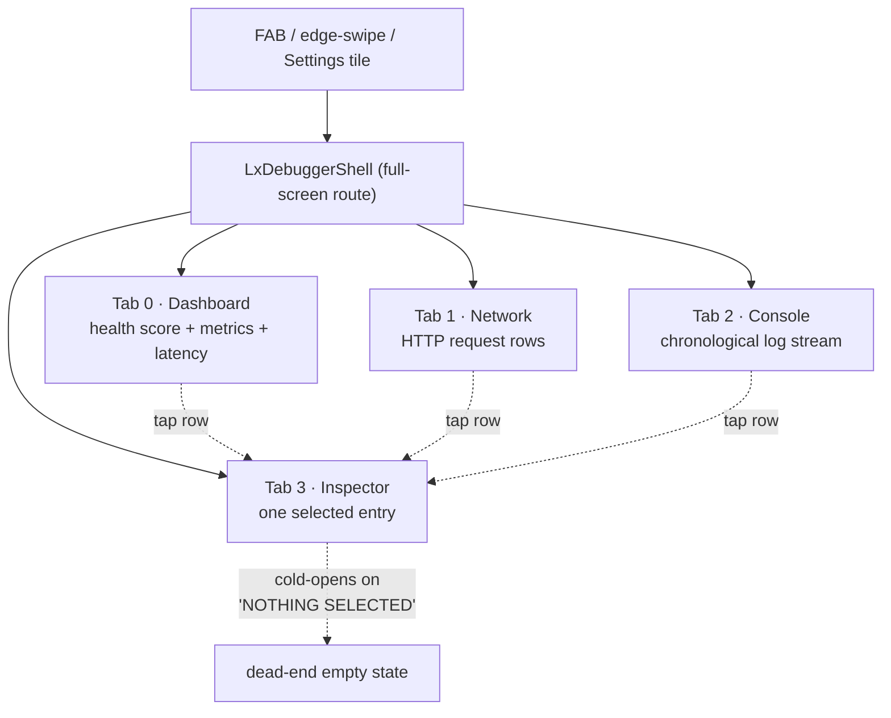
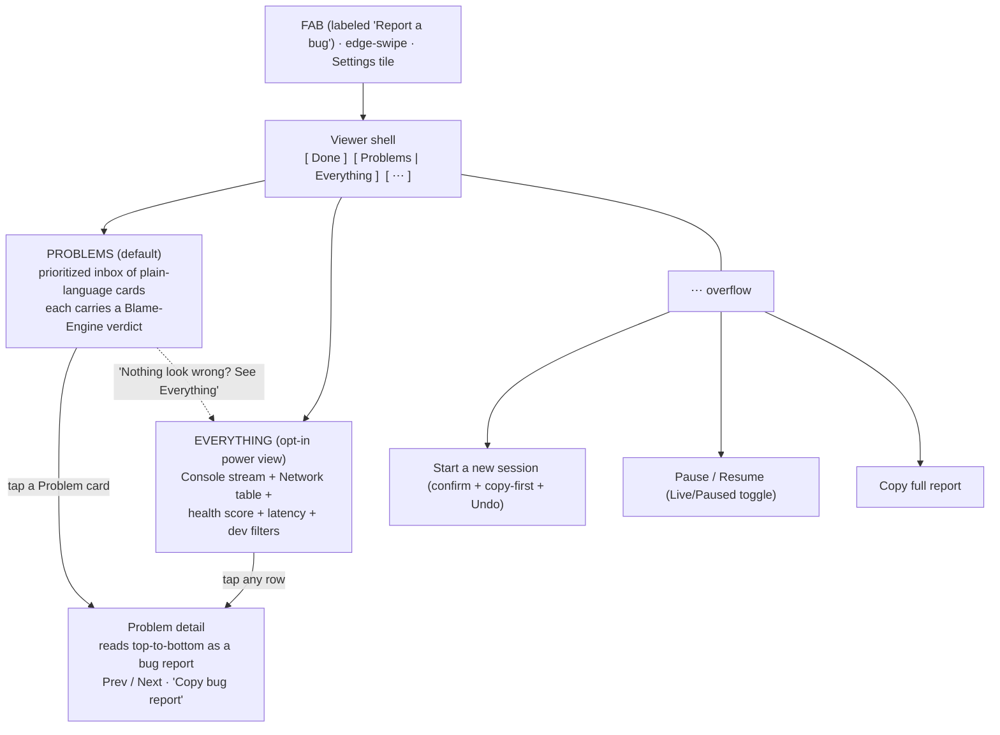
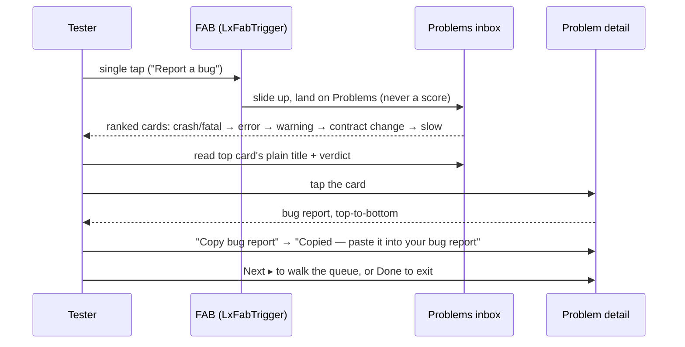
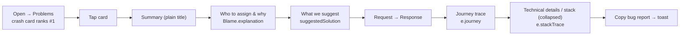
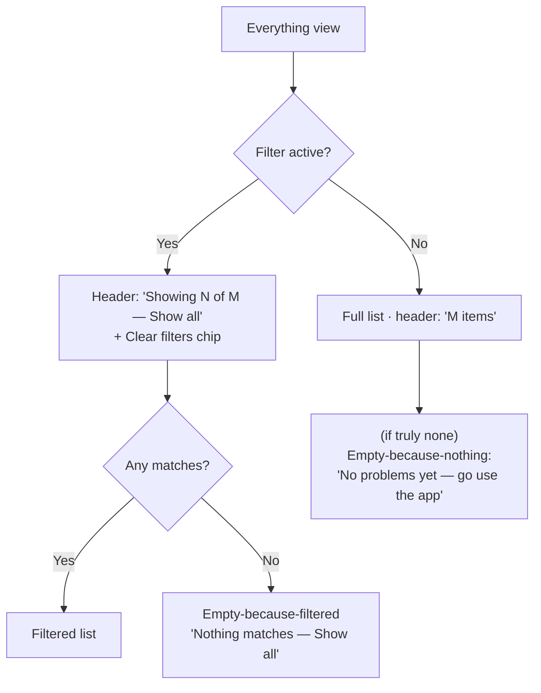

# LayerX In-App Debugger Viewer — UX Redesign

**Direction: Triage Inbox (with a built-in Copilot verdict)**
**Target user: a non-technical QA tester, manual tester, product manager, or client — never used the app, reads no docs, needs zero training.**
**Date: 2026-07-01**

---

## Executive Summary

The LayerX in-app debugger viewer is styled as a "Neo Terminal" — a shell-prompt header, a blinking cursor, monospace everywhere, and sub-AA neon-on-black. It reads and behaves like a *developer* tool, but its actual audience is a non-technical tester who must find a bug and hand it to a developer. Against that standard the tool fails at its most critical steps: a single unconfirmed tap on a red trash icon wipes the entire bug-report evidence (memory-only, no undo); the headline AVG LATENCY metric renders the literal text "ms" with no number; the primary "Copy" button is silent and reads as broken; a documented QA job (retry the failing call) is structurally impossible and nothing says so; and developer jargon (Δ, schema/contract, raw source enums, ISO timestamps) pervades the surface.

The chosen direction is a **Triage Inbox with a built-in Copilot verdict**. The list unit becomes a plain-language **Problem**, ranked worst-first, and each card already carries a verdict ("Looks like the server's fault") sourced from `LayerXBlameEngine` — code that exists, is exported, and is wired into zero UI today. One obvious action, **"Copy bug report,"** assembles the whole issue. Everything developers relied on is preserved one tap behind an **"Everything"** view.

Headline changes: destructive one-tap Clear removed; a single consistent copy component; friendly labels wired from existing code; honest empty/paused/filtered states; accessibility treated as a floor. Expected outcome: the tester's job collapses to *open → read the top card's verdict → Copy bug report → paste into the ticket* — no training, nothing destructive within one mis-tap, and no screen that pretends to do what it cannot.

---

## Design Principles

1. **The unit is a Problem, not a log line.** The list shows discrete things a human would report, using the existing `LxKit.isProblem` predicate plus a slow-request rule.
2. **Every card speaks first.** Each Problem carries a hedged, plain-language verdict from the already-built `LayerXBlameEngine` — verdicts are always one tap from raw evidence so a developer can overrule.
3. **One job-to-be-done: Copy bug report.** A single formatter assembles the whole issue; it is the only copy component, with one consistent confirmation.
4. **Demote, never delete.** Console stream, Network table, health score, latency chart, and all developer filters move behind an "Everything" view; power users lose nothing.
5. **Safe by default.** No one-tap destructive Clear; a deliberate "Start a new session" gated by copy-first and Undo. The tool never claims "healthy" for "untested."
6. **Honest states.** Empty-because-nothing is visually distinct from empty-because-filtered; paused is unmistakable; observe-only scope is stated on screen.
7. **Surface what already exists.** `source.label`, `suggestedSolution`, relative time, and Request-before-Response order are all built in code and simply not wired up — surfacing them is the largest, lowest-risk win.
8. **Accessibility is a floor, not a polish pass.** ≥4.5:1 contrast on load-bearing text, ≥48dp targets, `Semantics` on every control, reduce-motion support, and dynamic-type safety.
9. **Calm, not alarming.** Retire the perpetual pulse, the blinking cursor, and neon-on-black; reserve motion and color for real state changes; give crashes the strongest, highest-contrast treatment because they rank first.

---

## 1. Complete UX Audit

This audit evaluates the LayerX in-app debugger viewer against a single, unforgiving standard: **a non-technical QA tester, manual tester, product manager, or client who has never used the app, reads no documentation, and should need zero training.** Every finding below was verified against the actual source in `lib/src/`. The verdict of the persona walkthrough is unambiguous: this tool reads and behaves like a *developer* tool, not a zero-training QA tool. A tester can complete the easy 60% — tap the floating button, read the health score, spot red failing calls — but the end-to-end job the product exists for, *"find a bug and hand it to a developer,"* breaks at its most critical steps.

Two headline facts frame everything that follows:

1. **The single most valuable asset in the tool — the accumulated log trail, which *is* the bug report — can be destroyed by one unconfirmed, un-undoable tap**, and the destructive control sits inches from the actions testers reach for most.
2. **A documented core QA job (retry the failing call) is structurally impossible**, and nothing on screen tells the tester the tool only observes.

The audit is organized in three parts: **(A) cross-cutting themes** that recur across every screen, **(B) a screen-by-screen breakdown** with each issue's impact and severity, and **(C) the persona walkthrough** that shows how these defects compound into task failure. Severity uses four levels: **Critical** (blocks the core job, destroys data, or actively misinforms), **High** (a non-technical user cannot reasonably self-serve past it), **Medium** (causes confusion, friction, or false reports), **Low** (polish, trust, and consistency gaps).

---

### A. Cross-Cutting Themes

Before the screen-by-screen detail, eight themes explain *why* the individual defects matter — they are not isolated bugs but systemic patterns.

| # | Theme | What it means for the tester |
|---|-------|------------------------------|
| 1 | **Data-loss by design** | The log trail (the deliverable) is destroyable by one unconfirmed tap, and the destructive control sits next to the copy/pause actions testers hunt through. The store is memory-only, so a wipe is permanent and unrecoverable. |
| 2 | **Hidden functionality** | The most tester-relevant features — Export/Copy-All, drag, edge-swipe, level filtering, close — live behind invisible gestures, icon-only buttons, or tooltip-only labels. They are discoverable only if someone tells you. |
| 3 | **Inconsistency erodes trust** | The same action behaves differently across the tool: copy sometimes toasts and sometimes is silent; one feature is named four ways; time is ISO here and `HH:MM:SS` there; tabs run Response-before-Request. Testers read polish gaps as bugs. |
| 4 | **Developer-first vocabulary & aesthetic** | Shell-prompt headers, `Δ`/schema/contract, raw source enums, HTTP verbs, VERBOSE/DEBUG levels, and a neon-terminal palette all signal *"not for you"* — even though friendlier labels already exist in the code and are simply not wired up. |
| 5 | **Ambiguous / undifferentiated states** | Empty-because-filtered vs. empty-because-no-data, paused vs. broken, and healthy-100 vs. untested all look identical, driving false bug reports and premature sign-off. |
| 6 | **Signals that don't signal** | A perpetual pulse animation and a context-switching, unlabeled badge cry wolf constantly, so a real problem has no distinct attention cue left to escalate with. |
| 7 | **Accessibility floors unmet** | Sub-AA contrast (worst on the crash color), sub-48dp targets, no reduce-motion handling, no screen-reader semantics, and layouts that clip under text scaling make load-bearing content unreadable or unhittable for exactly this audience. |
| 8 | **Observe-only tool sold as a QA workflow** | It records but cannot act (no retry/replay, no single "copy this issue as a bug report"), and it never states its scope — so a documented core job is silently impossible. |

---

### B. Screen-by-Screen Findings

#### B.1 — FAB (floating bug button) + edge-swipe trigger + how the viewer opens

The FAB is the only entry point a non-technical tester will realistically find. It is a 50×50px near-black circle with a colored border, a bug icon, and a numeric badge, spawned bottom-right. It has **four behaviors** — tap, drag, long-press, and a silently-mutating badge — but a visual affordance for only one.

| Issue | Why it hurts | Severity |
|-------|--------------|----------|
| **No first-run coach mark, tooltip, or label anywhere** (`lx_fab_trigger.dart:192-199`). The first thing every tester ever sees is a bare pulsing green circle with a bug outline and no text. | The persona reads no docs. A bare glowing icon could be a decoration, an ad, or part of the app under test. They may never realize this is *the tool they were told to use to file bugs* — defeating the product's purpose on first contact. | **Critical** |
| **Three of four behaviors are invisible**: drag-to-reposition (`onPanUpdate`, lines 128-138), long-press quick menu (`onLongPress → _showQuickMenu`, line 140), and the badge silently changing meaning. No handle, no "⋯", no label, no hint. | A tester will only ever discover the single tap. The exact action they most need — **Export & Copy All** to attach logs to a bug report — lives *only* behind the undiscoverable long-press. They will never find it unless told. | **High** |
| **The FAB badge silently switches what it counts** (`lx_fab_trigger.dart:122-124`): total log count when healthy, then error+fatal count only the instant an error appears. A badge reading "40" can drop to "2" the moment the first error lands. | A PM tracking "how many things has QA captured" sees the number plummet at the worst possible moment and reads it as *"problems went down"* or *"logs were lost"* — exactly when a real failure occurs. | **Medium** |
| **The pulse ring animates forever** on an 1800ms loop (`lx_fab_trigger.dart:36-42, 149-161`), identically in the healthy green state and the error red state. | Pulsing means "attention needed" everywhere in software. Because the healthy state also pulses, the animation carries no signal — it cries wolf all session, so a real error has no stronger motion to escalate with (only a hue swap). | **Medium / High** |
| **Edge-swipe is a phantom feature**: a 20px hot zone marked only by a 1.5px cyan hairline at 0.3 alpha (`lx_edge_trigger.dart:55-61`) — no icon, label, tooltip, or hint. | Undiscoverable by looking; if triggered by accident, the sudden full-screen slide-up feels like a bug, not a feature. Two redundant, undiscoverable entry points are IA bloat, not helpfulness. | **Low / Medium** |
| **`Clear All Logs` in the long-press menu wipes the store with no confirmation** (`lx_fab_trigger.dart:288-299`), showing only a "Logs cleared" toast after the fact, with no undo. | A first-time tester exploring an unfamiliar menu — exactly what a self-teaching UI invites — can wipe every captured log in one accidental tap, with no way to recover. | **Critical** |
| **Prod/release discoverability**: per the recent default-to-debug-only change, the FAB may not render at all in a release build, with nothing on screen indicating the debugger exists. | A tester on the build they are actually testing may have no way in and no signal that the tool is there. | **Gap** |

#### B.2 — Shared shell: app bar, bottom nav, close control

Every tab shares one app bar. Its most prominent element is a Unix shell prompt with a blinking cursor; its three actions are icon-only; and there is no explicit close control.

| Issue | Why it hurts | Severity |
|-------|--------------|----------|
| **The header is a Unix shell prompt** — `layerx@dbg ~/console $ 42 logs` with `@host`, `~/path`, a `$` glyph, and a perpetually blinking block cursor (`lx_debugger_shell.dart:140-189, 226-269`). The plain screen name is buried, lowercased, inside the prompt. | A QA/PM has no mental model for a Unix prompt; `@dbg`, `~/`, `$` are noise. The blinking cursor even reads as a text field they can type into. The one persistent orienting text on every screen is gibberish to the persona, and it eats the highest-value real estate. | **High** |
| **No explicit close / back control** in the app bar `leading` (`lx_debugger_shell.dart:130`). Closing relies on a default back arrow (which may not render on the installer's own navigator) or the non-obvious iOS edge gesture; the FAB and edge trigger both vanish while open. | A tester who wants back to the app has no obvious button and can feel *trapped*, especially on iOS where there is no hardware back button. | **High** |
| **All three toolbar actions are icon-only with tooltip-only labels**: pause/play, `copy_all_outlined` (Export), `delete_sweep_outlined` (Clear) (`lx_debugger_shell.dart:191-221`). Tooltips never surface on touch. `copy_all` and `delete_sweep` look alike at 20px. | Told to "copy the logs and send them," the tester must guess which grey glyph is export vs. the destructive clear — and guessing wrong wipes all evidence. | **High** |
| **The red `Clear all` trash icon wipes the entire store with no confirmation, no undo, and no toast at all** (`lx_debugger_shell.dart:212-220` → `LayerXLogStore.clear()`). It is more silent than the FAB menu's clear, which at least toasts. It sits immediately beside the copy and pause icons. | This is the **single highest-consequence interaction in the tool with the least protection.** A tester hunting for the copy button mis-taps the adjacent red icon, loses a whole session's evidence, gets no "Are you sure?" beforehand and no "Undo" afterward — and, with zero feedback, may think the tool crashed rather than realize they destroyed their own data. | **Critical** |
| **Two adjacent nav badges count different things with no legend** (`lx_debugger_shell.dart:116-119`, `lx_bottom_nav.dart`): Network badge (green) = total network calls; Console badge (red) = error+fatal only. Same shape, same position. | A tester reads "Network 12" and "Console 3" as two counts of the same kind. They cannot infer green = volume, red = problems, and may panic at a large green number or miss that the red "3" means "3 errors." | **High** |
| **The `Inspector` bottom-nav tab is a dead end** (`lx_debugger_shell.dart:120`, `lx_inspector_pane.dart:36-42`). Tapping it cold shows only "NOTHING SELECTED" with no picker or action; "Inspector" is itself a DevTools term. | A tester exploring the four tabs in order taps Inspector, lands on a blank instructional card, and is taught on first run that *"this tab does nothing"* — eroding trust exactly when onboarding matters. | **Medium** |
| **Pause freezes all panes with only a 20px amber icon as the cue** (`lx_debugger_shell.dart:192-202`). No banner, watermark, toast, or "PAUSED" chip appears in any pane; a paused pane is visually identical to a live one. | A tester who accidentally paused reproduces a bug, returns to Console expecting the new error, and sees nothing new — reading exactly like *"the debugger stopped working."* They file a false bug when the fix is one tap they don't know about. | **Medium** |

#### B.3 — Dashboard pane

The landing tab. A health-score hero, a four-card metrics grid, a latency chart, and a "Recent Issues" list.

| Issue | Why it hurts | Severity |
|-------|--------------|----------|
| **The AVG LATENCY metric card renders the literal string `'ms'` with no number.** Line 176 is `_Metric('AVG LATENCY', avgLatency == 0 ? '—' : 'ms', LxTheme.accent)` — the computed average (lines 34-36) is never interpolated. Whenever any latency data exists, the most visually dominant element on the card (22px bold) is the bare unit `ms`. | The Dashboard is the health snapshot a PM/QA opens first. A headline metric that permanently reads "ms" is unanswerable for *"is the app slow?"*, looks broken, and poisons trust in every other number on the screen. The tester may report the debugger itself as broken instead of noticing a genuinely slow API. **Verified in source. One-line fix: `'${avgLatency}ms'`.** | **Critical** |
| **"Healthy 100" on an empty session is indistinguishable from "verified good"** (`lx_dashboard_pane.dart:47-53, 96-111`). The empty state shows only while `logs.isEmpty`; the instant one benign INFO log arrives, the pane jumps to score 100, a green ring, "Session healthy / All systems nominal." The score starts at 100 and only decreases. | A PM glancing at "Session healthy / 100" on a fresh session may believe QA coverage is complete and sign off prematurely, when they simply haven't done anything. A green 100 that means "no evidence" masquerading as "confirmed healthy" is actively misleading for the exact decision the Dashboard exists to support. | **Medium** |
| **`SCHEMA Δ` metric card** (line 177) uses a Greek delta plus the developer word "schema," while the hero calls the same thing "contract change" (line 110) and Inspector calls it "CONTRACT CHANGES." | The metrics grid is the at-a-glance scoreboard, yet the fourth card is opaque — a tester can't tell if a non-zero value is good or bad, and the same concept is named three different ways on three screens, so it never coheres into a mental model. | **High** (jargon) / **Low** (per-card) |
| **"Recent Issues" is hard-capped at `.take(6)` with no overflow cue** (`lx_dashboard_pane.dart:45`). If 25 issues exist, 6 show silently while the hero may say "12 errors · 5 warnings." | The visible list and the headline count silently disagree; the tester can't reconcile them and may conclude issues are missing (false report) or under-report the real count. | **Medium** |
| **Empty-state copy is data-engineer phrasing**: "Interact with the app to populate the dashboard." (lines 51-53). | "Populate" is jargon; the first screen inside the tool teaches nothing about what the tool or its four tabs do. | **Low** / **High** (as onboarding gap) |
| **Health encoded largely in color**: the score ring and metric values signal severity by hue with no shape cue; the latency chart bars are colored by status with no axis, labels, legend, or per-bar value. | A colorblind PM sees a red "38" and a green "95" as the same weight, and the latency chart is a wall of same-ish bars. They cannot judge health at a glance — the Dashboard's whole job. | **Medium** |
| **The health ring renders instantly** (`AlwaysStoppedAnimation`, lines 130-137) with no fill sweep or count-up. | The hero element of a "dashboard" feels flat and cheap next to the animated nav and staggered rows elsewhere in the same product. | **Low** |

#### B.4 — Network pane

The tool's strongest screen: color-coded method pills, status coloring, tap-to-drill-in. Its problems are jargon, ambiguous empties, and a missing per-row copy.

| Issue | Why it hurts | Severity |
|-------|--------------|----------|
| **`Δ Changed` filter chip and `Δ` status suffix are unexplained math symbols** (`lx_network_pane.dart:149, 188-194`). A changed 200 renders as "200Δ" and turns orange — the *same* orange as a real 4xx error. | A client/PM won't recognize `Δ`. Worse, an orange "200Δ" (a healthy response whose body merely changed) looks identically severe to an orange "404" (an actual failure) — the tool tells them "both are equally concerning" via color when they are not. | **High** (jargon) / **Medium** (color collision) |
| **One empty state for two situations** (`lx_network_pane.dart:63-65`): "NO REQUESTS / No network calls match this view yet" shows whether zero calls exist *or* a stale Errors/Slow chip is hiding everything. No "Clear filters" button. | A tester who left an Errors chip active sees an empty screen and confidently files a false bug — *"the app made no network calls"* — when their filter is simply too narrow, with no visible reset path. | **High** |
| **No per-row copy** (`lx_network_pane.dart:156-221`); rows support only a single tap into Inspector, unlike Console. Copying one failing call means: tap row → switch to Response/Request tab → tap Copy (which then gives no feedback). | Copying a failing API call is the #1 Network task. Requiring a 3+ tap drill-in ending in a silent copy is a higher-friction, broken-feeling path than Console's direct per-row copy. | **Medium** |
| **Search placeholder is "filter endpoints…"** and there is no clear-X (`lx_network_pane.dart:93-99`). | "Endpoint" means nothing to a PM; the search box instructs them with a word they don't know, and resetting means holding backspace. | **Medium** |
| **Status by color alone**: 2xx/3xx/4xx/5xx distinguished by hue via `LxKit.statusColor`; error rows marked only by a 3px colored left rail — no icon, no "FAIL" text. | A red/green colorblind tester (~8% of men) cannot distinguish a 500 from a 200; the left rail is on the exact hue axis they can't perceive. | **Medium** |
| **HTTP verbs and bare status codes are untranslated** (GET/POST/PUT/PATCH/DELETE; "404"/"500"; "—" for missing). | Color does heavy lifting, but "404" vs "500" both just mean "it failed," and "—" gives no hint whether the call is pending, silent, or unrecorded. | **Low** |

#### B.5 — Console pane

A chronological feed with search, an icon-only level filter, and up to 13 category chips.

| Issue | Why it hurts | Severity |
|-------|--------------|----------|
| **One empty state for two situations** (`lx_console_pane.dart:54-56`): "NO LOGS / Nothing matches the current filter" appears whether the store is truly empty or a filter excludes everything. No "Clear filters" escape hatch. | A tester who left a stale level/category filter sees "NO LOGS" and wrongly reports *"nothing was logged."* With three independently-located filters (search + level + category) and no single reset, they can get stuck on a dead-end empty screen and conclude the tool is broken. | **High** |
| **The level filter is a bare 42px funnel icon** (`lx_console_pane.dart:110-148`), indistinguishable in weight from the search box beside it; its active state is only a hairline border color shift from dim green to bright green; no visible clear. | Testers are explicitly told to "filter logs to find bugs," yet the primary severity filter is a bare icon they won't discover, and if they do set it, they won't notice it stays active — leading to a filtered-empty state they misread as "no logs captured." | **Medium / High** |
| **Category chips leak the tech stack** (`layerx_log_category.dart:46-73`): "Dart Exceptions," "Flutter Framework," "UI Exceptions," "Lifecycle." "UI Exceptions" vs "Dart Exceptions" is a developer-only distinction. | A tester can't tell "UI Exceptions" from "Dart Exceptions" — both just mean "the app broke" — so they can't choose which to tap, and "Flutter"/"Dart" leak a stack a client shouldn't need to know. | **High** |
| **The 7-level filter menu is developer vocabulary** (`layerx_log_level.dart:68`): VERBOSE / DEBUG / INFO / SUCCESS / WARNING / ERROR / FATAL. | A tester doesn't know VERBOSE is noisier than DEBUG, or that FATAL vs ERROR is recoverable-vs-not. Four to five of seven items are noise to this persona — choice overload. | **Medium** |
| **The meta line prints the raw lowercase source enum and an unlabeled `×N`** (`lx_console_pane.dart:194-198, 237`): "14:32:07 · app · ×3". | "app"/"backend" as a bare word tells a tester nothing, and "×3" has no label — they may read it as an ID or a typo rather than "happened 3 times." | **Medium** |
| **Triple-encoded severity, missing category** (`lx_console_pane.dart:192-257`): a 3px rail + a colored icon + red message text all repeat severity, while the human category label (the most scannable attribute) is absent from the row and the readable time is tiny dim text. | Severity shouts three times while the one thing a tester scans by — *what kind of log this is* — is only visible after tapping into Inspector. | **Medium** |
| **Up to 13 multi-color chips with no scroll affordance** (`lx_console_pane.dart:150-190`); category colors collide with method-pill and level-rail colors, so "green" means three different things. | The palette stops being a learnable code; finding the right category becomes a reading exercise, and chips off the right edge are hidden with no cue. | **Medium** |
| **The per-row copy target is ~22×16px** (`lx_console_pane.dart:241-251`), unlabeled, at the row edge, adjacent to the whole-row navigate tap. | Fat-finger misses open Inspector instead of copying, so copy feels broken; users with larger fingers or motor impairments cannot reliably hit it — well under the 48dp minimum. | **High** |

#### B.6 — Inspector pane (detail view)

The deep-dive for one entry: header, four sub-tabs, a collapsible stack trace.

| Issue | Why it hurts | Severity |
|-------|--------------|----------|
| **The Response/Request "Copy" button gives no feedback** (`lx_inspector_pane.dart:301-308`): `Clipboard.setData` with no snackbar — while the stack-trace copy right beside it (line 269) *does* toast "Stack trace copied ✓," and Console per-row copy toasts "Log copied ✓." Of the tool's four+ copy paths, exactly one — the primary one for grabbing a failing API body — is silent. | The tester's core loop is copy-body → paste-into-ticket. They tap "Copy" on a JSON response, see nothing, and reasonably conclude it's broken — so they tap repeatedly, paste stale clipboard content, or file a false bug against the debugger. **This is the single most likely false-positive bug a tester will file against the tool itself.** | **Critical** |
| **Tabs run Response *before* Request** (`lx_inspector_pane.dart:44`, order verified: `['Overview','Response','Request','Trace']`). | Everyone expects you send a request, then get a response. Seeing Response first reads as a typo or a UI bug, undermines trust in the tool's polish, and makes people tap the wrong payload tab. | **Low** |
| **"Source" prints the raw lowercase enum** (`lx_inspector_pane.dart:182`, `e.source.name` → "app"/"backend"/"network") — even though `LayerXLogSource.label` ("📱 App Issue," "🖥 Server Error," "⚙️ Backend") already exists and *is used in the export* (`layerx_log_store.dart:108`). | The single most decision-relevant field for a PM — *"is this the app's fault or the server's?"* — is shown in its least understandable form, and the human-readable version the code already built is thrown away. The UI simply calls the wrong getter. | **High** |
| **"Time" shows raw ISO-8601** (`lx_inspector_pane.dart:192`, `toIso8601String()`, e.g. `2026-07-02T14:03:11.482Z`) while the Trace tab two taps away shows friendly `HH:MM:SS`. | The `T`, milliseconds, and `Z` are a machine format; the tester may think the time is wrong (UTC vs their wall clock) and file a false "the timestamp is wrong" report, and the same screen contradicting itself on time makes the tool feel unpolished. | **Medium** |
| **The DETAILS list is a flat 12-row dump** (`lx_inspector_pane.dart:180-193`) with all rows at identical weight — the Message a tester would screenshot has no more prominence than "Occurrences." | For a non-technical viewer, everything looks equally (un)important; the one thing worth attaching to a bug report has no visual priority over developer plumbing. | **Medium** |
| **"Trace," "STACK TRACE," and "CONTRACT CHANGES" are unexplained jargon** (`lx_inspector_pane.dart:44, 165, 265`); the stack copy summary embeds `(file.dart:123)` tokens. | A PM has never heard "stack trace" and won't know whether it's safe or useful to include — so they may omit the single most useful thing to attach to a crash report because its label scares them off. | **Medium** |
| **No prev/next navigation within Inspector** (`lx_inspector_pane.dart`). The only way to change the entry is to go back to another tab, find the row, and re-tap (which resets to Overview). | Stepping through 6 flagged issues costs ~3-4 taps *each* (~3N total) instead of N — tedious and error-prone when compiling a multi-issue report. | **Medium** |
| **Raw, unformatted payloads**: Response/Request bodies are dumped as raw single-line text in a monospace box — no pretty-print, no syntax coloring. | A non-developer faces a wall of text and can't visually parse it or know what to screenshot. | **Medium** |
| **Inner tab switches are hard cuts** (`lx_inspector_pane.dart:107`) while the shell's top-level tabs cross-fade (shell lines 82-105). | One nav level animates, the nested level pops — the tool feels inconsistent with itself, and an abrupt swap can make it unclear the tab even changed. | **Low** |

#### B.7 — Settings entry tile (`LayerXDebugSettingsButton`)

An alternate drop-in entry point on the host app's own settings screen.

| Issue | Why it hurts | Severity |
|-------|--------------|----------|
| **Title "LayerX Debug Logger," subtitle "128 logs • 4 errors"** (`lx_debug_settings_button.dart:31-34`), where "errors" combines ERROR + FATAL app-wide. | "Debug Logger" signals *"for programmers, not me."* "4 errors" is easily misread by a PM as "4 crashes," misjudging severity — the data already distinguishes error vs fatal, but the tile hides it. | **Low** |
| **Inconsistent look & transition vs. the FAB path** (`lx_debug_settings_button.dart:37-41`): a stock grey `ListTile` opening via `MaterialPageRoute` (platform push), while the FAB opens the *same* shell with a bespoke 380ms slide-up. | The two entry points feel like two different products, breaking the illusion of one cohesive tool. | **Low** |

---

### C. Accessibility & Readability — Unmet Floors

These apply globally and are treated as a floor, not a polish pass, because the target audience (QA/PM/older stakeholders) is precisely the group these failures exclude.

| Issue | Why it hurts | Severity |
|-------|--------------|----------|
| **`textDim` (#38573F) is ~2.4:1** on the black backgrounds — far below WCAG AA 4.5:1 — yet used for *real content*: Console timestamps/source/`×N`, search placeholders, empty-state subtitles, Trace timestamps, chevrons (`lx_console_pane.dart:237`, `lx_ui_kit.dart:162`, et al.). | A tester reads the timestamp and source on every row to write a bug report; at 2.4:1 that's near-invisible on a phone in a bright office, and unreadable placeholders hide that filtering exists at all. | **High** |
| **The FATAL/Crash color (#B71C1C) is the lowest-contrast color in the app** (~2.98:1), used for the FATAL dot/label, fatal row rails, and the active "Crash Logs" chip (`layerx_log_level.dart`, `layerx_log_category.dart`). | The single most important thing a tester must see — a crash — is made the *least* visible. Colorblind or low-vision testers may miss crashes entirely, or be unable to pick "FATAL" out of the filter menu. | **High** |
| **The FAB badge is white on bright green (1.98:1) / red (3.03:1) at 8px** (`lx_fab_trigger.dart:203-227`). | The badge is the only passive at-a-glance signal outside the viewer; unreadable, a tester can't tell "2" from "7" from "12," defeating its entire purpose. The bottom nav already uses correct black text — this is a fixable inconsistency. | **High** |
| **Zero screen-reader semantics anywhere** — not one `Semantics` widget or `semanticLabel` in the reviewed files. Icon-only controls expose only tooltips; the FAB is a raw `GestureDetector` (`lx_fab_trigger.dart:127`). | A TalkBack/VoiceOver user hears "button" or silence for copy, clear, pause, and filter — and could trigger the unlabeled destructive **Clear all** without knowing what they tapped. | **High** |
| **No text-scaling accommodation**: fixed-height search fields (`height:38`), chip strip (`height:36`), row rails (`height:30`), latency chart (`height:46`), with `maxLines:1/2` + ellipsis on tiny base fonts (10px meta, 9.5px nav, 8px badge). | Anyone over ~45 with larger system fonts sees the very message/status/timestamp the tool exists to surface get clipped or cropped inside fixed containers. | **High** |
| **No reduce-motion handling**: the FAB pulse, the blinking cursor, and the per-row stagger loop forever; nowhere checks `MediaQuery.disableAnimations` (`lx_fab_trigger.dart:36-42`, `lx_debugger_shell.dart:236-239`, `lx_ui_kit.dart:132-148`). | A tester with vestibular sensitivity gets pulsing glow and a blinking block in their periphery the entire session, and the never-resting pulse reads as a permanent false alarm. | **Medium** |
| **The stagger animation replays on every keystroke/new log** (`lx_ui_kit.dart:132-148`, keyed by *index* not entry id), so rows re-animate on each filter change. | The list appears to "flash"/re-shuffle every time the tester types a search letter — reading as flicker/instability, not polish, and making fast scanning during live capture harder. | **High** |
| **The near-black palette gives cards almost no separation** (surface #080D0A vs bg #03060A; hairline #12301E borders). | Structure is hard to parse — a tappable chip looks like static text, and one card blends into the next. | **Medium** |
| **Touch targets below 48dp**: the per-row copy icon (~22×16px), the 20px edge-swipe zone, and the ~40px-tall nav rows. | Fat-finger misses fire the wrong action; the primary "copy" action is unreliable for the exact users this tool targets. | **Medium / High** |

---

### D. Feedback, Consistency & Safe-State Gaps

| Issue | Why it hurts | Severity |
|-------|--------------|----------|
| **Four copy paths, four different confirmations** — "Log copied ✓" (Console row), "Logs copied ✓" (Export all), "All logs copied to clipboard ✓" (FAB menu), "Stack trace copied ✓" (Inspector stack), and *nothing* (Inspector payload). | The one-letter "Log" vs "Logs" difference makes a tester unsure whether they grabbed one entry or the whole report, so they attach the wrong thing; the silent path reads as broken. | **Medium** |
| **Export has no empty guard** (`layerx_log_store.dart:96-160`): an empty store still toasts success and copies a header-only report. | A tester who exports on an empty/just-cleared session gets a confident "copied ✓," pastes it into a ticket, and delivers an essentially empty report believing it has evidence — a silent data-loss trap. | **Medium** |
| **Snackbars are 2s, un-queued, un-announced, and can render over the bottom nav** (`lx_theme.dart:158-167`); no `hideCurrentSnackBar()`. | A tester who looks away misses the only feedback; rapid copies queue and replay for seconds, feeling laggy and ambiguous. | **Low / Medium** |
| **Filter chips are single-select, non-toggling** (`lx_console_pane.dart:155-190`, `lx_network_pane.dart:111-153`): tapping an active chip does nothing; there is no combined "N filters active / Clear all" control even though Console ANDs search + level + category. | A tester who set three filters and sees an empty list has three separately-located controls to hunt down, with no single escape hatch — and can easily conclude "no logs." | **Medium** |
| **Chips and Inspector tab pills are bare `GestureDetector`s** with no ink ripple or pressed state (`lx_network_pane.dart:116`, `lx_console_pane.dart:159`, `lx_inspector_pane.dart:106`), while rows use `InkWell`. | Tapping a chip gives no "I registered your tap" acknowledgement, so on a mis-tap or slow device the tester taps again; the controls feel dead next to the rows below them. | **Medium** |
| **No haptic feedback anywhere** (verified across FAB, shell, all panes). | On mobile, the total absence of haptics — especially for the long-press menu (where a "pop" is the standard cue the gesture registered) and destructive clear — makes even correct interactions feel flat and uncertain. | **Medium** |
| **Neither search field has a clear-X or result count** (`lx_console_pane.dart:86`, `lx_network_pane.dart:93`). | Resetting a long query means holding backspace — a constant friction every mainstream search box solves with one tap. | **Medium** |
| **FAB dragging has no pickup/drop feedback or snap-to-edge** (`lx_fab_trigger.dart:129-137`); the button just follows the finger and stops dead. | A tester who accidentally starts a drag gets no reassurance and may think the button is glitching stuck to their finger; the movable affordance is never taught. | **Low** |

---

### E. Structural Gaps — Jobs the Tool Cannot Do

These are not bugs in a screen; they are missing capabilities that make the stated QA workflow impossible or incomplete.

| Gap | Why it hurts | Severity |
|-----|--------------|----------|
| **No retry / resend / replay anywhere.** A codebase-wide search returns zero UI affordances; the only "retry" strings are advisory sentences inside suggested-fix text. Rows support a single tap into the read-only Inspector — no long-press, no swipe, no replay button — and *nothing on screen says the tool is observe-only.* | "Retry the failing call" is one of the five core QA jobs. A tester told to do it will hunt every screen, find nothing, assume they missed a button, and be fully blocked. Even with training, this job is impossible as built. At minimum the tool must state its scope so the tester isn't stranded. | **Critical** |
| **No single "Copy this issue as a bug report" action.** No path assembles message + friendly source + status + relative time + payloads + suggested fix + stack for *one* issue. The tester must hand-stitch pieces from multiple tabs. | This is the actual job-to-be-done, and no current path performs it — while inconsistent per-field copy makes even the manual stitching untrustworthy. | **High / Gap** |
| **No screenshot / attachment / share-sheet path.** The tool only ever copies text to the clipboard. | Non-technical bug reports usually include a screenshot and go out via a share sheet (email/Slack/ticket); there is no share integration. | **Gap** |
| **No persistence or session identity.** Logs live only in memory; there is no save-to-file, no session name, no survival across restart — which is *why* Clear is catastrophic. | A tester who backgrounds the app or crashes it may lose the very evidence of the crash. | **Gap** |
| **No global search or one consistent issue count.** Search is per-pane; three surfaces (FAB badge, Settings tile, Dashboard) count "errors"/"issues" with different, switching meanings. | A tester who knows only "the login thing failed" can't search across logs + network + crashes, and the counts never agree, so no number can be trusted as *the* problem count. | **Gap** |

---

### F. Persona Walkthrough — How the Defects Compound Into Task Failure

The findings above are severe individually; the walkthrough shows how they stack into a broken end-to-end workflow. **Verdict: yes, a non-technical tester would need training or a rework — and even with training, two jobs are impossible or actively misleading as built.**

| Step (job) | What works | Where they get stuck | Severity |
|------------|-----------|----------------------|----------|
| **1. Open the viewer** | The FAB is eye-catching; the tap works and slides up nicely. | The perpetual pulse reads as an "alert" before they open anything; three of four entry behaviors (drag, long-press export/clear, edge-swipe) are invisible; on a release build the FAB may not render at all. | Medium |
| **2. Orient in the tool** | The four bottom tabs are a clear anchor. | The `layerx@dbg ~/dashboard $` shell-prompt header is meaningless; "Inspector" is opaque until a row is tapped; the neon-terminal aesthetic signals "not for me." | Medium |
| **3. Check if the app is healthy** | The health hero and its plain-English label are the best part of the tool. | **AVG LATENCY shows a bare "ms" with no number**, so "is the app slow?" is unanswerable; "SCHEMA Δ" is an undefined glyph. | High |
| **4. Find a failing network call** | The strongest screen — color-coded pills and status make failures easy to spot. | The `Δ` suffix/filter is unexplained; the single empty state can't distinguish "no calls" from "a stale filter hid them." | Medium |
| **5. Understand a crash in plain language** | When a suggested-fix tip card is present, it's excellent. | It appears only on *some* entries; otherwise the tester faces raw source enums, ISO timestamps, unformatted JSON, an unexplained "STACK TRACE," and a reversed Response-before-Request tab order that reads as a bug. | High |
| **6. Retry the failing call** | — | **There is no retry anywhere in the codebase**, and nothing says the tool only observes. The tester hunts every screen, finds nothing, and is completely blocked. | **Critical** |
| **7. Copy a bug report to a developer** | — | **No single "copy this issue" action**; the Inspector payload "Copy" is **silent** and reads as broken; "Export all" grabs *everything*, not the one issue, and its toast is one letter different from the per-row toast; and the **unguarded "Clear all"** sits right next to the copy icons — one stray tap wipes the whole trail with no confirmation and no undo. | **Critical** |

**The three highest-impact fixes, in order:**
1. Add a real, single **"Copy this issue as a bug report"** action with a confirmation toast — *and* put a confirm + undo on **"Clear all"** in both the app bar and the FAB menu.
2. **Fix the AVG LATENCY value** so it renders the number (`'${avgLatency}ms'`).
3. Either add a **retry** affordance or **clearly state the viewer is observe-only** ("this records what happened — reproduce the action in the app").

Until these are addressed, the tool delivers the easy 60% — open, glance, spot red — but fails the exact job it exists for: safely handing a clean, complete bug report to a developer. The redesign that follows is grounded in a decisive discovery this audit surfaced: **much of the plain-language layer this persona needs already exists in the code** (`LayerXBlameEngine`, `source.label`, `suggestedSolution`, `exportLogsAsString`) and is simply never wired into the UI. The largest wins are therefore surfacing-what-exists, not building-new.


---

## 2. Information Architecture, Navigation & User Flows

This section defines the new information architecture for the LayerX viewer, the navigation model that replaces the four-tab "Neo Terminal" shell, and six core user-flow diagrams that trace the exact taps a non-technical tester makes. Every screen, control, and data field named below maps to a real component in the codebase; where the redesign changes behavior, the old and new are contrasted directly.

---

### 2.1 The organizing principle: the unit is a Problem, not a log line

The current viewer is organized around *log data*: a Dashboard of aggregate metrics, a Network table of every HTTP call, a Console stream of every print, and an Inspector for one entry. The tester has to know which of the four tabs holds the thing they are chasing, and then translate raw fields (`e.source.name` → `"app"`, an ISO-8601 timestamp, a bare `Δ`) into a human judgment.

The redesign inverts this. The top-level unit becomes a **Problem** — a discrete thing a human would actually report ("The app crashed," "Couldn't load your profile — server error," "This screen was slow"). Membership is defined by the predicate that *already exists* in the code, `LxKit.isProblem` (`lib/src/mvvm/view/shell/lx_ui_kit.dart:19`), which returns true for `error`, `fatal`, `warning`, or `responseChanged` entries. We extend it with one rule — a **slow-request rule** keyed on `LxKit.durationOf(e)` (the `extras['duration_ms']` reader at `lx_ui_kit.dart:14`) so latency surfaces as a plain Problem row instead of the broken "AVG LATENCY → ms" metric card.

Everything a developer relied on — the raw Console stream (`lx_console_pane.dart`), the Network table (`lx_network_pane.dart`), the health score and latency chart (`lx_dashboard_pane.dart`), and the level/category/source filters — is **preserved and demoted one tap behind an "Everything" view**, never deleted.

---

### 2.2 Old IA vs. new IA

**Old IA — a four-destination peer bottom bar** (built in `lx_debugger_shell.dart:111-122` via `LxBottomNav`, `lib/src/widgets/parts/lx_bottom_nav.dart`):



Problems with the old IA, all verified in source:
- **Four co-equal tabs** force the tester to guess where to look; the labels are lowercased `dashboard / network / console / inspector` (`lx_bottom_nav.dart:133`).
- **Inspector is a first-class tab but a dead end** — tapping it cold shows only `NOTHING SELECTED` (`lx_inspector_pane.dart:36-42`), teaching a first-run user that a tab "does nothing."
- **The landing tab is the Dashboard health score**, so a fresh, un-exercised session can read "Session healthy / 100" (the audit's rank-13 issue).
- **The most decision-relevant asset is unwired**: `LayerXBlameEngine.analyze()` (`lib/src/mvvm/view_model/layerx_blame_engine.dart`) produces `responsibleParty`, a plain-English `explanation`, and a `qaNote` phrased as bug-report guidance, yet it appears in zero UI files.

**New IA — a two-level tree with one obvious default**:



| Aspect | Old (`LxDebuggerShell`) | New |
|---|---|---|
| Top-level structure | 4-tab bottom nav (`LxBottomNav`) | 2-segment control: **Problems / Everything** |
| Default landing | Dashboard health score (index 0) | **Problems** inbox (never a score, never a blank) |
| Detail screen | Inspector as a peer tab (cold-opens blank) | Problem detail reached **only by tapping a Problem**; cannot cold-open empty |
| Card content | raw fields (`source.name`, ISO time, `Δ`) | plain title + `source.label` fault chip + one-line Blame-Engine verdict + relative time + `×N` from `occurrenceCount` |
| Primary action | none end-to-end; 4 inconsistent copy paths | one **"Copy bug report"** button per Problem |
| Close control | implicit back arrow (may not render) | always-present labeled **Done** |
| Clear | one-tap red `delete_sweep` (`lx_debugger_shell.dart:212`), no confirm | removed; **"Start a new session"** in overflow, gated by confirm + copy-first + Undo |
| Skin | shell prompt `layerx@dbg ~/console $` + blinking cursor (`lx_debugger_shell.dart:140-189, 226-269`) | calm, high-contrast, plain-language surface |

---

### 2.3 Navigation model in detail

**Entry (unchanged surfaces, clarified affordances).** The `LxFabTrigger` (`lib/src/widgets/lx_fab_trigger.dart`) remains the single primary entry, but gains a **resting text label ("Report a bug")** and a one-time first-run coach bubble, so the bare pulsing bug icon is no longer the only cue. Drag-to-move (`onPanUpdate`, line 129) and the edge-swipe hairline (`LxEdgeTrigger`, `lib/src/widgets/lx_edge_trigger.dart`) remain as undocumented bonuses, not primary paths. The FAB badge (`lx_fab_trigger.dart:203-228`) is redefined to always count **one thing — open Problems** — the same definition used by the Problems header and the Settings tile subtitle (`lx_debug_settings_button.dart:34`, today an inconsistent `"$totalCount logs • $errorCount errors"`).

**Top bar.** Left: an always-present labeled **Done**, so no one feels trapped (today there is no explicit close in `lx_debugger_shell.dart`). Center: the **[ Problems | Everything ]** segmented control that replaces the four-tab bottom bar. Right: an **overflow (⋯)** holding "Start a new session," "Pause / Resume," and "Copy full report" (the latter modeled on `LayerXLogStore.copyExportToClipboard`, currently the `copy_all` app-bar action at `lx_debugger_shell.dart:203-211`).

**Detail as a pushed layer, not a tab.** Opening a Problem pushes the detail (the reworked Inspector) with **Prev / Next chevrons** so a tester walks the queue without returning to the list. The detail scrolls **top-to-bottom in bug-report order**, which corrects the reversed tab order in the current Inspector where `Response` is listed before `Request` (`lx_inspector_pane.dart:44`).

**Pause.** The lone amber glyph (`lx_debugger_shell.dart:192-202`) becomes a labeled **Live / Paused toggle** with a persistent full-width "Paused — not capturing new problems" banner across whichever view is active, since a paused pane is otherwise visually identical to a live one.

---

### 2.4 Core user flows

The task calls for open→triage, find a failed request, understand + share a crash, retry, and filter. Each is given as a numbered step flow (the tap-by-tap reality) plus, where useful, a diagram. Old-path friction is contrasted inline.

#### Flow A — Open → Triage (the 90% loop)



1. Tester taps the FAB once. The viewer slides up (the existing 380ms `easeOutCubic` push, `lx_fab_trigger.dart:82`) and lands on **Problems**, not the Dashboard.
2. The inbox shows Problem cards ranked **severity-then-recency**: crash/`fatal` first, then `error`, then `warning`, then `responseChanged` (contract change), then slow requests. Each card = plain title + a fault chip from `source.label` ("📱 App Issue" / "🖥 Server Error", `layerx_log_source.dart:40-53`) + a hedged one-line verdict from `LayerXBlameEngine.analyze().explanation` + relative time + `×N` from `occurrenceCount`.
3. Tester reads the top card and taps it → detail opens.
4. Tester taps **Copy bug report** → single consistent toast → pastes into their ticket → **Next ▸** or **Done**.

*Old vs new:* today this loop does not exist end-to-end — the tester lands on a health score, must guess a tab, and there is no single action that assembles a report.

#### Flow B — Find a failed request

1. Open → **Problems**. A `4xx`/`5xx` call already appears as a card near the top (membership via `isProblem`; status colored by `LxKit.statusColor`, `lx_ui_kit.dart:42-48`), verdict-first — the tester does not need to know it was "in the Network tab."
2. If they want the request among *all* traffic, tap **Everything**, which absorbs today's `LxNetworkPane`. The four filter chips (`All / Errors / Slow / Δ Changed`, `lx_network_pane.dart:146-149`) move into a filter sheet, with **"Δ Changed" relabeled to plain language** ("Response changed shape").
3. Tap the request row → detail. Header keeps the method pill + path + status, but the body now reads **Request before Response** (fixing `lx_inspector_pane.dart:44`) and shows the Blame-Engine verdict for that status code (e.g. `503` → "Backend / DevOps — Service Unavailable," `layerx_blame_engine.dart:58-68`).
4. **Copy bug report** captures method, endpoint, status, relative time, request/response payloads, suggested fix, and stack in one action.

*Old vs new:* Network rows today have no per-row copy — the tester must drill into the Inspector and hit the **silent** payload Copy (`lx_inspector_pane.dart:303-307`, no snackbar), which reads as broken.

#### Flow C — Understand + share a crash



1. Open → Problems. A `fatal` crash gets the **highest-contrast treatment** and ranks first (dropping the near-invisible `#B71C1C`).
2. Tap the crash card. Detail reads top-to-bottom: **Summary → Who to assign & why** (`Blame.responsibleParty` + `explanation` — e.g. "null-check on a null value… shared blame backend + mobile," `layerx_blame_engine.dart:321-326`) **→ What we suggest** (`e.suggestedSolution`, today only in the Overview tip card at `lx_inspector_pane.dart:141-162`) **→ Request → Response → Journey trace** (`e.journey`, `lx_inspector_pane.dart:323-380`) **→ collapsed Technical details / stack** (`e.stackTrace`, `lx_inspector_pane.dart:246-286`).
3. **Copy bug report** assembles everything, including the `qaNote` ("Assign to: Mobile Team. Attach the stack trace," `layerx_blame_engine.dart:319`), via a single-issue formatter modeled on `exportLogsAsString`.

*Old vs new:* today the tester hand-stitches message, source, ISO timestamp, payload, and stack across tabs; the Blame Engine that would tell them who to assign is not shown at all.

#### Flow D — "Retry the failing call" (honest scope, not a dead hunt)

Retry/replay **cannot exist** — there is no such affordance anywhere in the code (rows carry only a single `onTap` → detail, e.g. `lx_network_pane.dart:208`), and the memory-only store (`LayerXLogStore`) has no request-replay path. The redesign makes the observe-only scope **explicit on screen** instead of leaving the tester searching every tab:

1. Open → Problems. The header/empty copy states the scope: *"This records what happened — it can't retry for you. Redo the action in the app to capture a fresh attempt."*
2. Tester redoes the action in the app; the new attempt appears as a new Problem card (or an `occurrenceCount` bump → `×N`).
3. Tester taps it and **Copy bug report**.

*Old vs new:* today nothing states the scope, so a tester told to "retry" searches all four tabs and the Inspector fruitlessly and stays blocked (audit rank-2). "Share sheet / attachments" and cross-restart persistence are likewise **out of scope here**, but the single-issue formatter and "session" framing leave clean seams to add them.

#### Flow E — Filter (and never mistake filtered-empty for nothing-captured)

1. In **Everything**, open the filter sheet (absorbing the Console level filter, category chips, and search — `lx_console_pane.dart`).
2. Applying any filter flips the sticky header to **"Showing N of M — Show all,"** with a visible **Clear filters** chip. This distinguishes the two empty states the code currently conflates: `lx_console_pane.dart:54-56` and `lx_network_pane.dart:63-65` both reuse one message whether data is truly absent or a stale filter hides it.
3. **"Show all" / Clear filters** resets in one tap — today the only reset for a level filter is to reopen the menu and pick "All levels," and search fields have no clear button.



#### Flow F — Start a new session (the safe replacement for destructive Clear)

1. Overflow (⋯) → **Start a new session**.
2. A confirm sheet: *"This clears all N captured problems and can't be undone,"* with a **primary "Copy report first"** button and a same-toast **Undo**.
3. Only on confirm does `LayerXLogStore.clear()` run (and `LayerXViewerState.selected` reset).

*Old vs new:* today `clear()` fires immediately from a red trash icon (`lx_debugger_shell.dart:212-220`, no toast, no undo) sitting beside the copy button, and from the hidden FAB long-press menu (`lx_fab_trigger.dart:288-299`) — the single highest-consequence, least-protected interaction in the tool.

---

### 2.5 IA change summary

- **Removed from the tester path:** the four-tab bottom bar, the shell prompt and blinking cursor, health-score-as-landing, the standalone Inspector tab, and the app-bar trash icon.
- **Demoted, not deleted (one tap behind "Everything"):** Console stream, Network table, health score, latency chart, and all developer level/category/source filters.
- **Newly surfaced (already in code, previously unwired):** `LayerXBlameEngine.analyze()` verdicts, `source.label`, `suggestedSolution` on every card, relative + `HH:MM:SS` time (replacing `toIso8601String()` at `lx_inspector_pane.dart:192`), and Request-before-Response order.
- **One count, one meaning:** FAB badge = Problems header = Settings tile = "open problems."
- **Stated on screen:** observe-only scope; retry/replay and persistence are explicitly future seams, not shipped here.

**Files referenced:** `/Users/umairhashmi/StudioProjects/layerxdebugger/lib/src/mvvm/view/shell/lx_debugger_shell.dart`, `.../lx_inspector_pane.dart`, `.../lx_network_pane.dart`, `.../lx_console_pane.dart`, `.../lx_dashboard_pane.dart`, `.../lx_ui_kit.dart`, `/Users/umairhashmi/StudioProjects/layerxdebugger/lib/src/widgets/parts/lx_bottom_nav.dart`, `.../lx_debug_settings_button.dart`, `/Users/umairhashmi/StudioProjects/layerxdebugger/lib/src/widgets/lx_fab_trigger.dart`, `.../lx_edge_trigger.dart`, `/Users/umairhashmi/StudioProjects/layerxdebugger/lib/src/mvvm/view_model/layerx_blame_engine.dart`, `/Users/umairhashmi/StudioProjects/layerxdebugger/lib/src/config/enums/layerx_log_source.dart`.


---

## 3. Screen-by-Screen Redesign

This section specifies the redesigned surface screen-by-screen for the **Triage Inbox (with a built-in Copilot verdict)** direction. Each screen lists the layout top-to-bottom, the plain-language labels that replace developer jargon, the actions available, and an ASCII wireframe.

Two principles govern every screen and are stated here once:

- **The unit is a Problem, not a log line.** A "Problem" is any entry where `LxKit.isProblem` is true (`error` / `fatal` / `warning` / `responseChanged`) plus a new **slow-request rule** (`extras['duration_ms'] >= 800`). This is the exact predicate already in `lx_ui_kit.dart:19`, extended by one clause.
- **Every card speaks first.** Each Problem carries a plain-language verdict from `LayerXBlameEngine.analyze()` (`lib/src/mvvm/view_model/layerx_blame_engine.dart`) — currently built, exported, and wired into zero UI files. Surfacing it is the single highest-leverage change in this redesign.

### 3.0 Global terminology map (applies to every screen)

Everything below is a lookup the whole document references. "Old" is what the code renders today; "New" is what the tester sees after the redesign. The New column is what the components must display.

| Old (in code today) | New (plain language) | Where it lives now |
| --- | --- | --- |
| `layerx@dbg ~/console $ 42 logs` (shell prompt) | Screen title: **"Problems"** / **"Everything"** + count | `lx_debugger_shell.dart:140-189` |
| Blinking block cursor | *(removed)* | `lx_debugger_shell.dart:227-269` |
| `Dashboard` / `Network` / `Console` / `Inspector` (4 tabs) | Segmented control: **Problems** \| **Everything**; detail is not a tab | `lx_bottom_nav.dart`, `lx_debugger_shell.dart:33` |
| `source.name` → `app` / `server` / `backend` / `network` | `source.label` → **📱 App Issue** / **🖥 Server Error** / **⚙️ Backend** / **🌐 Network** / **❓ Unknown** | `lx_inspector_pane.dart:182`, `lx_console_pane.dart:196` |
| `Δ Changed`, `200Δ`, `SCHEMA Δ`, `CONTRACT CHANGES` | **"The server's data changed shape"** / chip: **"Data changed"** | `lx_network_pane.dart:149,189`, `lx_dashboard_pane.dart:177`, `lx_inspector_pane.dart:165` |
| `AVG LATENCY` = `'ms'` (bug: no number) | **"Typical speed — 420 ms"** (interpolated) | `lx_dashboard_pane.dart:176` |
| `Slow` filter chip | **"Slow"** kept, plus a plain Problem row: **"This screen was slow (1.4 s)"** | `lx_network_pane.dart:148` |
| ISO time `2026-07-02T14:03:11.482Z` | **"2 min ago"** (relative) + `14:03:11` on the same line | `lx_inspector_pane.dart:192` |
| Tab order **Response → Request** | **Request → Response** (send → receive) | `lx_inspector_pane.dart:44` |
| `VERBOSE / DEBUG / INFO / SUCCESS / WARNING / ERROR / FATAL` | Demoted into Everything; Problems uses **Crash / Error / Warning / Data change / Slow** | `layerx_log_level.dart:68` |
| Category chips (`Dart Exceptions`, `Flutter Framework`, …) | Demoted into Everything's filter sheet | `layerx_log_category.dart:46` |
| `×3` occurrence suffix | **"happened 3 times"** | `lx_console_pane.dart:197` |
| "Clear all" trash icon / "Clear All Logs" | *(removed as one-tap)* → **"Start a new session"** (confirm + copy-first + undo) | `lx_debugger_shell.dart:212`, `lx_fab_trigger.dart:288` |
| "Export & Copy All" / "Export all" / silent "Copy" | **"Copy bug report"** (one component, one toast) | `lx_fab_trigger.dart:278`, `lx_debugger_shell.dart:205`, `lx_inspector_pane.dart:304` |
| Toasts: `Log copied ✓` / `Logs copied ✓` / `All logs copied to clipboard ✓` / `Stack trace copied ✓` / *(silent)* | One toast: **"Copied — paste it into your bug report"** | multiple |
| `NOTHING SELECTED` (cold Inspector tab) | *(impossible)* — detail only opens from a tapped Problem | `lx_inspector_pane.dart:36-42` |
| Health score `100` on empty session | *(removed from tester path)* → **"No problems yet"** | `lx_dashboard_pane.dart:91` |
| `LayerX Debug Logger — 128 logs • 4 errors` (settings tile) | **"Report a bug — 4 problems found"** | `lx_debug_settings_button.dart:31-34` |

Color/contrast floor applied everywhere: drop `textDim #38573F` (~2.4:1) and `fatal #B71C1C` (~2.98:1) for load-bearing text; crashes get the highest-contrast treatment because they rank first; all tap targets ≥ 48 dp; `Semantics`/`semanticLabel` on every control; the perpetual FAB pulse (`lx_fab_trigger.dart:36-42`) and blinking cursor honor `MediaQuery.disableAnimations` (reduce-motion).

---

### 3.1 Entry — the floating "Report a bug" button (FAB) + edge swipe

Replaces `lx_fab_trigger.dart` and `lx_edge_trigger.dart`. The FAB stays the single discoverable entry; drag and edge-swipe survive as undocumented bonuses.

**Layout (resting state), left-to-right:**
1. A pill, not a bare circle: bug glyph **+ a text label "Report a bug"**. The label is the fix for "a glowing icon isn't recognized as the tool." It can collapse to a circle only after first use.
2. A count badge showing **one defined number — open problems** (the same number as the Problems header and the Settings tile). Uses `LxKit.isProblem` count, never the silent total-vs-error swap in `lx_fab_trigger.dart:124`. Badge is hidden at zero.
3. **First-run coach mark** — a one-time bubble pointing at the FAB: *"Found a bug? Tap here to see what went wrong and copy a report."* Dismissed on first open; never shown again.

**States:**
- **Calm (0 problems):** neutral high-contrast surface, bug outline, label "Report a bug", no badge, **no pulse**.
- **Problems present (N > 0):** the badge appears with N; a **single** attention pulse fires only when a *new* problem lands (not a perpetual 1800 ms loop), and is suppressed entirely under reduce-motion.
- **Crash present:** strongest treatment (high-contrast red fill, solid bug icon) since crashes rank first.
- **Dragging:** pulse suppressed (unchanged behavior, `lx_fab_trigger.dart:149`).
- **Viewer open:** FAB and edge strip hide (unchanged).

**Actions:**
- **Tap** → open the viewer on **Problems**.
- **Drag** → reposition (bonus, unchanged clamps).
- **Long-press** → *removed as a hidden menu.* Export/Clear no longer live behind a secret gesture; both are visible inside the viewer. (This deletes the undiscoverable-and-destructive quick menu in `lx_fab_trigger.dart:240-306`.)
- **Edge-swipe** → open the viewer (bonus). The 1.5 px hairline stays as a faint bonus cue; it is no longer the only path to anything.

```
   Resting (problems present)                First-run coach mark
 ┌───────────────────────────────┐        ┌───────────────────────────────┐
 │                               │        │   ┌───────────────────────┐   │
 │                               │        │   │ Found a bug? Tap here  │   │
 │                               │        │   │ to see what went wrong │   │
 │                               │        │   │ and copy a report.     │   │
 │                        (3)    │        │   └──────────────────▼────┘   │
 │              ╭──────────────╮ │        │              ╭──────────────╮ │
 │              │ 🐞 Report a  │ │        │              │ 🐞 Report a  │ │
 │              │    bug       │ │        │              │    bug       │ │
 │              ╰──────────────╯ │        │              ╰──────────────╯ │
 └───────────────────────────────┘        └───────────────────────────────┘
   • no perpetual pulse   • badge = "open problems" (matches header + settings)
```

---

### 3.2 Home — the Problems inbox (default landing)

The default screen. Absorbs the old **Dashboard** landing role but replaces the health-score hero and metrics grid with a prioritized, plain-language inbox. Built from the same `logsNotifier` stream the shell already listens to (`lx_debugger_shell.dart:57`).

**Layout, top-to-bottom:**
1. **Top bar** — replaces the shell-prompt title (`lx_debugger_shell.dart:140-189`):
   - Left: **"Close"** (always-present labeled control — fixes "no visible close / feels trapped").
   - Center: **segmented control [ Problems | Everything ]**.
   - Right: **overflow "⋯"** → *Copy full report*, *Pause / Resume*, *Start a new session*.
2. **Honest count line (sticky):** **"3 problems"**. When any search/filter is active it flips to **"Showing 2 of 3 — Show all"** — the one line that makes filtered-empty distinguishable from truly-empty.
3. **Paused banner (conditional):** full-width **"Paused — not capturing new problems"** whenever the Live/Paused toggle is off. Replaces the lone amber glyph in `lx_debugger_shell.dart:192`.
4. **Problem list**, ranked **severity then recency** (crash/fatal → error → warning → data-change → slow). Each **Problem card**:
   - **Plain title:** "The app crashed", "Couldn't load your profile (server error)", "This screen was slow (1.4 s)", "The server's data changed shape". For network problems the title is built from status + `LxKit.shortPath`, humanized.
   - **Fault chip** from `source.label`: 📱 App Issue / 🖥 Server Error / ⚙️ Backend / 🌐 Network / ❓ Unknown (replaces raw `source.name`).
   - **One-line verdict** from `LayerXBlameEngine.analyze().explanation`, hedged: *"Looks like the server's fault — not the app."*
   - **Relative time** ("2 min ago") + **"happened 3 times"** from `occurrenceCount` when > 1.
   - A left severity rail; crashes carry the strongest, highest-contrast color.
5. **Bottom of list / empty:** see 3.7.

**Actions:** tap a card → detail (3.5); tap "Show all" → clear filters; overflow → session actions; segmented control → Everything (3.3).

```
 ┌───────────────────────────────────────────────┐
 │ ✕ Close      [ Problems | Everything ]      ⋯  │
 ├───────────────────────────────────────────────┤
 │ 3 problems                                     │  ← "Showing 2 of 3 — Show all" when filtered
 ├───────────────────────────────────────────────┤
 │ ▌🔥 The app crashed                    2m ago  │
 │ ▌   📱 App Issue · Looks like the app's fault  │
 │ ▌   Tap for details & to copy a report      ›  │
 ├───────────────────────────────────────────────┤
 │ ▌⛔ Couldn't load your profile (500)   5m ago  │
 │ ▌   🖥 Server Error · Looks like the server —  │
 │ ▌   not the app · happened 3 times          ›  │
 ├───────────────────────────────────────────────┤
 │ ▌🔄 The server's data changed shape    6m ago  │
 │ ▌   ⚙️ Backend · A field was renamed/removed  ›  │
 ├───────────────────────────────────────────────┤
 │ ▌🐢 This screen was slow (1.4 s)      8m ago  │
 │ ▌   🌐 Network · Slower than 0.8 s          ›  │
 └───────────────────────────────────────────────┘
```

---

### 3.3 Everything — the power view (opt-in)

One tap behind the segmented control. Nothing developers had is lost; it is demoted, not deleted. This screen **absorbs the old Console stream, the Network table, the health score, the latency chart, and the metrics grid** so power users have a single home.

**Layout, top-to-bottom:**
1. Same top bar; segmented control now on **Everything**.
2. **Sub-toggle: [ Timeline | Network | Health ]** — the three surfaces that used to be separate tabs, now nested one level down.
   - **Timeline** = old Console (`lx_console_pane.dart`): the full chronological stream with per-row copy.
   - **Network** = old Network table (`lx_network_pane.dart`): request rows with method/status/latency.
   - **Health** = old Dashboard's charts: the metrics grid (with the **"ms"→"420 ms" fix**, `lx_dashboard_pane.dart:176`) and the latency chart, kept for power users only.
3. **Search + "Filters" button** opening a **filter sheet** that holds the developer controls moved out of the main view: level (VERBOSE…FATAL), category (Dart Exceptions, Flutter Framework, …), and source. A visible **"Clear filters"** chip appears whenever any filter is set.
4. **"Showing N of M — Show all"** header whenever filtered (same rule as Problems), so filtered-empty is never confused with no-data.

**Actions:** switch sub-toggle; search; open/clear filters; tap any row → detail (3.5); per-row copy (Timeline). A quiet nudge appears here from the Problems empty state ("Nothing looks wrong? See Everything").

```
 ┌───────────────────────────────────────────────┐
 │ ✕ Close      [ Problems |›Everything‹]      ⋯  │
 ├───────────────────────────────────────────────┤
 │ [ Timeline | Network | Health ]                │
 ├───────────────────────────────────────────────┤
 │ 🔍 Search…                        [ Filters ▾ ]│  ← "Clear filters ✕" chip when active
 ├───────────────────────────────────────────────┤
 │ TIMELINE                                       │
 │ 14:03:11 · 📱 App Issue                     ⧉  │
 │   Null check operator used on a null value     │
 │ 14:02:58 · 🌐 Network · happened 3 times    ⧉  │
 │   GET /api/users/42 → 500                       │
 ├───────────────────────────────────────────────┤
 │ NETWORK      GET /api/users/42   500   1.4 s ›│
 │ HEALTH       Requests 12 · Errors 3            │
 │              Typical speed — 420 ms            │  ← was the literal "ms" bug
 └───────────────────────────────────────────────┘
```

---

### 3.4 Console / logs (as it lives inside Everything → Timeline)

The old **Console** pane (`lx_console_pane.dart`) survives intact as Everything → Timeline, with jargon translated and feedback made consistent. It is documented separately here because it has its own row anatomy and copy affordance.

**Redesigned row, left-to-right:**
- Severity rail + icon (unchanged from `LxKit.levelIcon`).
- Message (first line, up to 2 lines).
- **Meta line, humanized:** replaces `14:32:07 · app · ×3` (`lx_console_pane.dart:194-198`) with **`2 min ago · 📱 App Issue · happened 3 times`** — relative time via a new helper, `source.label` instead of `source.name`, and "happened N times" instead of the unexplained `×N`.
- **Copy icon** enlarged to a **≥ 48 dp** target (was ~14 px, `lx_console_pane.dart:250`) and given `semanticLabel: 'Copy this log'`. Firing it shows the single shared toast **"Copied — paste it into your bug report"** (replacing `Log copied ✓`).

**Filters:** the level funnel (`lx_console_pane.dart:110`) and category chips (`:150`) move into Everything's **filter sheet**; the raw category names (`Dart Exceptions`, `Flutter Framework`) stay only there, where a power user is present. Search gains a visible clear-**✕**.

```
 ┌───────────────────────────────────────────────┐
 │ ▌ ⛔  Null check operator used on a null value │
 │ ▌     2 min ago · 📱 App Issue · happened 3×  ⧉│  ⧉ = ≥48dp copy target
 ├───────────────────────────────────────────────┤
 │ ▌ ℹ️  GET /api/users/42 → 500                 ⧉│
 │ ▌     5 min ago · 🖥 Server Error             │
 └───────────────────────────────────────────────┘
   old:  14:32:07 · app · ×3        (no clear button, tiny copy, silent-ish)
   new:  relative time · friendly source · plain repeat · one toast
```

---

### 3.5 Detail — the Problem, read top-to-bottom as a bug report

Replaces the **Inspector** pane (`lx_inspector_pane.dart`) and deletes it as a navigable destination. Reached **only** by tapping a Problem or an Everything row, so it can never cold-open on `NOTHING SELECTED` (`lx_inspector_pane.dart:36-42`). It is a single scrollable card in natural reading order — no sub-tabs to reverse.

**Layout, top-to-bottom (scroll):**
1. **Summary** — plain title + fault chip (`source.label`) + status + **relative time with clock** ("2 min ago · 14:03:11", fixing the raw ISO string at `lx_inspector_pane.dart:192`).
2. **What this means / who to assign** — `LayerXBlameEngine.analyze().explanation` + `.qaNote` (e.g. *"Assign to: Backend. Steps: Share endpoint, request payload, and timestamp."*). This is the blame engine's core payload, surfaced for the first time.
3. **What we suggest** — `suggestedSolution` (the amber tip card, promoted from Overview-only, `lx_inspector_pane.dart:141`).
4. **Request** — payload, **shown before Response** (fixes reversed order at `lx_inspector_pane.dart:44,126-129`).
5. **Response** — payload; if `responseChanged`, an inline **"The server's data changed shape"** block listing added/removed/type-changed fields in plain words (replaces "CONTRACT CHANGES", `lx_inspector_pane.dart:165`).
6. **What led here** — the journey timeline (`e.journey`), unchanged but relabeled from "Trace".
7. **Technical details / stack trace** — collapsed by default (`lx_inspector_pane.dart:246`); the raw dump for developers.

**Persistent controls (pinned):**
- **Primary button "Copy bug report"** — the one job-to-be-done. A new single-issue formatter modeled on `exportLogsAsString` (`layerx_log_store.dart:96`) assembles: plain title + `source.label` + status + relative time + request + response + suggested fix + `qaNote` + stack. Fires the one shared toast.
- **‹ Prev / Next ›** chevrons walk problems without returning to the list (fixes ~3N-tap review loop). Every copy in this pane — including the payload "Copy" that is **silent today** at `lx_inspector_pane.dart:304` — routes through the one component and toast.

```
 ┌───────────────────────────────────────────────┐
 │ ‹ Prev            Problem 2 of 3          Next ›│
 ├───────────────────────────────────────────────┤
 │ 🖥 Couldn't load your profile (500)            │
 │ 🖥 Server Error · 5 min ago · 14:03:11          │
 ├───────────────────────────────────────────────┤
 │ WHAT THIS MEANS / WHO TO ASSIGN                │
 │ The server threw an unhandled error. The app   │
 │ sent a valid request — this is server-side.    │
 │ Assign to: Backend. Steps: share endpoint,     │
 │ request payload, and timestamp.                │
 ├───────────────────────────────────────────────┤
 │ 💡 WHAT WE SUGGEST                             │
 │ Retry after the backend team confirms a fix.   │
 ├───────────────────────────────────────────────┤
 │ REQUEST     POST /api/users/42                 │  ← Request BEFORE Response
 │ { "id": 42 }                                   │
 ├───────────────────────────────────────────────┤
 │ RESPONSE    500                                │
 │ { "error": "internal" }                        │
 ├───────────────────────────────────────────────┤
 │ WHAT LED HERE   ● Opened Profile               │
 │                 ● Tapped Refresh               │
 │                 ● Request failed (error)       │
 ├───────────────────────────────────────────────┤
 │ ▸ Technical details / stack trace              │  (collapsed)
 ├───────────────────────────────────────────────┤
 │ [        📋  Copy bug report        ]          │  ← one action, one toast
 └───────────────────────────────────────────────┘
```

---

### 3.6 Settings entry tile

Redesigns `LayerXDebugSettingsButton` (`lx_debug_settings_button.dart`), the drop-in tile a host app places on its own settings screen.

**Changes:**
- Title **"Report a bug"** (was "LayerX Debug Logger" — dev framing).
- Subtitle uses the **one shared count**: **"4 problems found"** when N > 0, **"No problems yet"** at zero — replacing `128 logs • 4 errors` (`:34`), which mixed a raw total with an "errors" count a PM misreads as crashes.
- Opens the viewer on **Problems** (not the old Dashboard/index-0), matching the FAB path so both entries land in the same place.
- `semanticLabel: 'Report a bug — 4 problems found'`.

```
 ┌───────────────────────────────────────────────┐
 │ 🐞  Report a bug                             › │
 │     4 problems found                           │   (old: "128 logs • 4 errors")
 └───────────────────────────────────────────────┘
```

---

### 3.7 Empty & error states (honest, differentiated)

The single most trust-critical fix: today one empty state (`LxKit.emptyState`, `lx_ui_kit.dart:150`) serves both "nothing captured" and "your filter hid everything," and the health hero shows "Healthy 100" on an untested session (`lx_dashboard_pane.dart:91`). The redesign makes each state distinct and states the tool's scope on screen.

**A. Problems — empty because nothing is wrong (inbox zero):**
This is the *positive* state, and it must never look like "verified healthy" (there is no 0–100 score in the tester path).

```
 ┌───────────────────────────────────────────────┐
 │                     ✅                          │
 │              No problems yet                    │
 │  Go use the app — this records what happens.    │
 │  It can't retry actions for you; redo them      │
 │  in the app to reproduce a bug.                 │
 │              [ See Everything ]                 │  ← nudge to the power view
 └───────────────────────────────────────────────┘
```

**B. Empty because filtered** (Problems or Everything) — visually distinct, always offers the escape:

```
 ┌───────────────────────────────────────────────┐
 │ Showing 0 of 3 — a filter is hiding them        │
 │                     🔍                          │
 │        Nothing matches your filters.            │
 │              [ Show all ]                        │  ← the escape today's empty state lacks
 └───────────────────────────────────────────────┘
```

**C. Payload / trace empty (in detail):** plain sentences replace "NO RESPONSE BODY" / "NO TRACE" — e.g. **"This problem has no response data"**, **"No steps were recorded for this problem."**

**D. Paused (not an error, but often mistaken for one):** a persistent full-width banner across whichever view is active — **"Paused — not capturing new problems"** with an inline **Resume** — replacing the lone amber glyph (`lx_debugger_shell.dart:192`).

**E. Destructive "new session" confirm (the anti-data-loss state):** the old one-tap `clear()` (`lx_debugger_shell.dart:212`, `lx_fab_trigger.dart:288`) is gone. "Start a new session" opens a confirm sheet that offers **copy-first** and shows an **Undo**:

```
 ┌───────────────────────────────────────────────┐
 │              Start a new session?               │
 │  This clears all 3 captured problems and        │
 │  can't be undone.                               │
 │  [ Copy report first ]   [ Cancel ]  [ Clear ] │
 └───────────────────────────────────────────────┘
              ↓ after Clear
 ┌───────────────────────────────────────────────┐
 │  Session cleared.                       [Undo] │
 └───────────────────────────────────────────────┘
```

---

### 3.8 Explicitly out of scope (stated on screen, per audit honesty)

To avoid the "sold as a workflow it can't perform" failure, the tool states its limits rather than hiding them:

- **No true retry/replay** — impossible by design (no such affordance exists in code). The Problems header/empty copy says *"this records what happened — redo the action in the app."*
- **No cross-restart persistence** and **no OS share-sheet/screenshots** — the store is memory-only (`layerx_log_store.dart:22`). The **single-issue formatter** and the **"session"** framing leave clean seams to add Share and persistence later, but neither ships here.


---

## 4. Visual Design System & Component Redesign

This section defines **LayerX DS 2026** — the design language that replaces the current "Neo Terminal" skin (`lib/src/config/lx_theme.dart`, `lib/src/mvvm/view/shell/lx_ui_kit.dart`). The redesign is deliberately conservative in one respect: it keeps a single tasteful green accent so the product still *feels* like LayerX, but it retires everything that signals "hacker console, not for you" — pure-black backgrounds, monospace-everywhere, the shell prompt, the blinking cursor, and the sub-AA neon-on-black contrast.

Every token below is a concrete value ready to drop into `LxTheme`. The current implementation exposes flat `static const Color` fields and helper methods (`card()`, `pill()`, `railCard()`, `snackBar()`); the token structure below maps onto that exact shape so the migration is a find-and-replace of values plus a light-mode branch, not a rewrite.

---

### 4.1 Design principles

1. **Calm, not alarming.** The tool is open *because* something is being investigated; the surface itself must not add noise. No perpetual pulse, no blink, no glow-by-default. Motion and color are reserved for real state changes.
2. **Contrast is a floor, not a finish.** Every text/background pair meets WCAG 2.2 **AA (4.5:1 for body, 3:1 for large text and UI components)**. The most severe state — a crash — gets the *strongest* treatment, reversing today's inversion where FATAL (`#B71C1C`, ~2.98:1) is the least visible color on screen.
3. **Plain surface for plain people.** Monospace is demoted to code payloads only (JSON, stack traces, endpoints). Everything a QA/PM reads — titles, verdicts, metadata, buttons — is a humanist sans.
4. **One token, one meaning.** Semantic colors (`danger`, `warning`, `success`) are defined once and reused, so "error red" is identical on a badge, a row rail, a chip, and a metric. Today the same idea is spelled four different reds (`accentRed #FF5C57`, level `error #EF5350`, level `fatal #B71C1C`, source `server #EF5350`).
5. **Light and dark are peers.** Testers on real devices in bright rooms are a primary persona. Light mode is a first-class theme, not an afterthought.

---

### 4.2 Color system

#### 4.2.1 Problems with today's palette (what we are fixing)

| Current token | Value | Measured contrast | Verdict |
|---|---|---|---|
| `textDim` on `surface` | `#38573F` on `#080D0A` | ~**2.4:1** | Fails AA — yet used for load-bearing content (timestamps, source, ×N, hints, placeholders) |
| `textSecondary` on `surface` | `#6FA982` on `#080D0A` | ~**5.6:1** | Passes, but greenish tint reads "terminal" |
| FAB badge text | `white` on `accent #39D353` | ~**1.98:1** | Fails badly — the one at-a-glance signal is glare |
| `fatal` level | `#B71C1C` on near-black | ~**2.98:1** | Fails — the most severe state is the least visible |
| `bg` / `surface` | `#03060A` / `#080D0A` | — | Near-identical; cards/search fields have almost no separation |

#### 4.2.2 Neutral ramp (dark mode)

A true neutral ramp with a *barely-there* cool tint (not green). This restores the layer separation the current `#03060A`/`#080D0A` pair loses.

| Token | Value | Role |
|---|---|---|
| `bg` | `#0B0E12` | App/scaffold background |
| `surface` | `#151A21` | Cards, app bar, bottom sheet, search fields (raised one step off `bg`) |
| `surfaceAlt` | `#1B222B` | Nested surfaces (payload boxes, expanded stack trace, chips-at-rest) |
| `surfaceHigh` | `#222B36` | Hover / pressed / selected chip / popovers |
| `border` | `#2A333F` | Default hairline (visible against both `bg` and `surface`) |
| `borderStrong` | `#3A4552` | Active field, selected control, focus ring base |
| `textPrimary` | `#F2F5F8` | Body & titles — **~15.8:1** on `surface` |
| `textSecondary` | `#AEB8C4` | Metadata, subtitles, meta line — **~7.9:1** on `surface` |
| `textTertiary` | `#8B95A2` | De-emphasized-but-still-legible — **~5.1:1** (this *replaces* `textDim`; there is no sub-AA text token) |
| `overlayScrim` | `rgba(0,0,0,0.55)` | Behind dialogs & sheets |

> **Key change:** the sub-AA `textDim #38573F` token is **deleted**, not dimmed. Anything currently drawn with it (row timestamps, `source`, `×N`, search placeholders, trace timestamps, empty-state icons) is re-pointed at `textTertiary` (`#8B95A2`, ≥5:1). Placeholder text and disabled states use `textTertiary` at full opacity, never a lower-contrast token.

#### 4.2.3 Neutral ramp (light mode)

| Token | Value | Role |
|---|---|---|
| `bg` | `#F5F7FA` | Scaffold |
| `surface` | `#FFFFFF` | Cards, app bar, sheets, fields |
| `surfaceAlt` | `#F0F3F7` | Nested surfaces / payload boxes |
| `surfaceHigh` | `#E6EBF1` | Hover / selected |
| `border` | `#D6DCE4` | Hairline |
| `borderStrong` | `#B3BCC8` | Active/selected control |
| `textPrimary` | `#101418` | **~17:1** on white |
| `textSecondary` | `#4A5563` | **~8.5:1** |
| `textTertiary` | `#697485` | **~5.2:1** |
| `overlayScrim` | `rgba(16,20,24,0.45)` | Behind modals |

#### 4.2.4 Brand & semantic accents

One brand green, plus a semantic set that is intentionally **muted vs. the current neon** so nothing screams by default. Each semantic color ships as a trio: `-solid` (fills/icons on light backgrounds), `-on` (text/icon color used *on* a tinted surface, contrast-tuned), and a `-tint` (12–16% wash for chip/rail backgrounds).

| Semantic | Dark `-solid` | Dark `-on` (text on tint) | Light `-solid` | Meaning in the tester UI |
|---|---|---|---|---|
| **brand** | `#3DD68C` | `#7FEBB4` | `#0E9F6E` | LayerX identity; primary buttons, "Live" state, healthy |
| **danger** | `#FF6B6B` | `#FF9B9B` | `#D92D20` | Errors (recoverable) |
| **critical** | `#FF3B3B` | `#FFB4B4` | `#B42318` | **Crash / fatal — the strongest, highest-contrast red** |
| **warning** | `#F4B740` | `#F7CE78` | `#B54708` | Warnings, "slow request", schema/shape change |
| **info** | `#5AA9FF` | `#93C6FF` | `#175CD3` | Neutral network/info |
| **success** | `#3DD68C` | `#7FEBB4` | `#039855` | 2xx, "no problems" inbox-zero |

**Method colors** (Network method pills, currently `LxKit.methodColor`) are re-pointed at the semantic set rather than raw neons: `GET → info`, `POST → brand`, `PUT/PATCH → warning`, `DELETE → critical`, other → `textSecondary`. This removes the purple/cyan/amber jumble and ties method color to a meaning the persona already reads elsewhere.

**Crash gets a dedicated, elevated treatment.** Because Problems rank crash-first, `critical` is the only accent allowed to fill an entire card header (not just a rail): a `critical-tint` header band with a `critical-solid` icon and `critical-on` text — all ≥4.5:1. This is the single most important contrast fix versus the `#B71C1C` status quo.

#### 4.2.5 Contrast contract (must hold in both modes)

- Body text ≥ **4.5:1**; large text (≥19px bold / ≥24px regular) and UI component boundaries ≥ **3:1**.
- Every semantic `-on` value is verified against its own `-tint` background *and* against `surface`.
- Focus ring: 2px `borderStrong` + 2px `brand` outer, ≥3:1 against adjacent surface.
- No information is conveyed by color alone — every colored rail/badge is paired with an icon and/or text label (crash = flame icon + "Crash"; slow = clock icon + "Slow"; changed = shape icon + "Changed").

---

### 4.3 Typography

Monospace is currently applied to nearly everything — the app-bar title, section labels, pills, metric values, meta lines, chips, snackbars. The redesign restricts monospace to **actual code**.

**Families**
- **Sans (primary):** platform humanist sans via `-apple-system`/Roboto stack (Flutter default `packages` fallback) — used for all reading text and controls.
- **Mono (code only):** the existing `'monospace'` family — used **only** for JSON payloads, stack traces, endpoint paths, and raw status codes.

**Type scale** (`fontSize` / `weight` / `lineHeight` / `letterSpacing`)

| Token | Size | Weight | Line | Tracking | Family | Used for |
|---|---|---|---|---|---|---|
| `display` | 28 | 700 | 1.15 | -0.2 | sans | Empty-state hero number / big count |
| `titleL` | 20 | 700 | 1.25 | -0.1 | sans | Sheet titles, detail header |
| `titleM` | 17 | 600 | 1.3 | 0 | sans | Problem card title, app-bar title |
| `body` | 15 | 400 | 1.5 | 0 | sans | Verdict lines, descriptions, dialog body |
| `bodyStrong` | 15 | 600 | 1.5 | 0 | sans | Emphasis within body, primary button label |
| `label` | 13 | 500 | 1.4 | 0.1 | sans | Chips, buttons, metadata, meta line |
| `caption` | 12 | 500 | 1.35 | 0.2 | sans | Timestamps, ×N, helper text |
| `overline` | 11 | 700 | 1.2 | 0.8 | sans | Section labels (replaces the 1.6-tracked mono `sectionLabel`) |
| `code` | 13 | 400 | 1.55 | 0 | **mono** | JSON payloads, stack traces |
| `codeSm` | 12 | 500 | 1.4 | 0 | **mono** | Endpoint path, status code, duration |

**Changes from today**
- `sectionLabel` drops from `letterSpacing: 1.6` mono to `overline` (0.8, sans) — still clearly a label, no longer a shouty ALL-CAPS terminal string.
- Metric values (currently 22px mono `w800`) become `display`/`titleL` sans. Numbers read as data, not as ASCII art.
- **All-caps is removed from user-facing copy.** `NO LOGS`, `NO REQUESTS`, `NOTHING SELECTED`, `CONTRACT CHANGES`, `STACK TRACE`, level labels shown to testers → sentence case. (Raw `LEVEL` uppercase may remain inside the demoted "Everything"/technical view.)
- **Dynamic Type:** all text respects `MediaQuery.textScaler`; fixed-height row/field containers (today `height: 38`, `height: 30`, `height: 36`) become `minHeight` with vertical padding so nothing clips at large font sizes.

---

### 4.4 Spacing, radius, elevation, motion tokens

**Spacing** — 4pt base grid (replaces the ad-hoc `10/11/13/14/16/18/28` mix currently sprinkled across panes).

| Token | Value |
|---|---|
| `space.0` | 0 |
| `space.1` | 4 |
| `space.2` | 8 |
| `space.3` | 12 |
| `space.4` | 16 |
| `space.5` | 20 |
| `space.6` | 24 |
| `space.8` | 32 |

Screen gutters = `space.4` (16). Card inner padding = `space.4`. Gap between stacked cards = `space.3` (12). Gap between list rows = `space.2` (8).

**Radius** — softer and consistent (today mixes `6/8/10/12/16/20`).

| Token | Value | Applied to |
|---|---|---|
| `radius.sm` | 8 | Chips, pills, badges, inputs |
| `radius.md` | 12 | Cards, list rows, buttons |
| `radius.lg` | 16 | Metric/hero cards, dialogs |
| `radius.xl` | 24 | Bottom sheets (top corners), FAB→sheet expansion |
| `radius.full` | 999 | Circular FAB, dot indicators |

> **Row-corner fix:** the current `LxKit.railCard` forces **square corners** because Flutter forbids `borderRadius` on a `Border` with non-uniform side colors (see the comment at `lx_ui_kit.dart:114`). The redesign draws the left rail as a **positioned child** (a `radius.full` colored bar inset inside a normally rounded `radius.md` card) instead of as a border side, so rows are fully rounded *and* keep the severity rail.

**Elevation** — replace the neon `glowShadow` (color-tinted blurs) with neutral, physical shadows. Glow is retired entirely except as an optional, reduce-motion-safe 1px focus accent.

| Token | Dark | Light |
|---|---|---|
| `elev.0` | none (hairline border does the work) | none |
| `elev.1` (cards) | `0 1 2 rgba(0,0,0,.4)` | `0 1 2 rgba(16,20,24,.06)` |
| `elev.2` (sheets, popovers) | `0 8 24 rgba(0,0,0,.5)` | `0 8 24 rgba(16,20,24,.12)` |
| `elev.3` (dialogs, FAB) | `0 12 32 rgba(0,0,0,.55)` | `0 12 32 rgba(16,20,24,.16)` |

**Motion** — every animation checks `MediaQuery.disableAnimations` / `MediaQuery.accessibleNavigation` (reduce-motion) and degrades to an instant state change.

| Token | Value | Curve | Notes |
|---|---|---|---|
| `motion.instant` | 0ms | — | reduce-motion fallback for all of the below |
| `motion.fast` | 120ms | easeOut | chip select, button press |
| `motion.base` | 200ms | easeOutCubic | tab/segment switch (keeps today's 220ms feel) |
| `motion.sheet` | 300ms | easeOutCubic | sheet & viewer slide-up (keeps 380ms → tightened) |

**Retired motion:** the perpetual FAB pulse ring (1800ms `repeat(reverse)`), the square-wave blinking cursor (`_LxBlinkingCursor`), and the per-row staggered fade/slide (`LxKit.stagger`, up to 320+240ms) are removed or gated behind reduce-motion. A new problem may trigger a **single** 200ms attention flash on the FAB — once, not forever.

---

### 4.5 Redesigned components

Each component below names the current widget it replaces and gives concrete specs. Sizes assume the ≥48dp touch-target floor throughout (today's 14px copy icon and 20px app-bar glyphs fail this).

#### 4.5.1 Card

*Replaces* `LxTheme.card()` / `cardAlt()` / the inline `BoxDecoration`s in the dashboard.

- `surface` fill, `1px border`, `radius.lg` (metric/hero) or `radius.md` (content), `elev.1`.
- Padding `space.4`. No glow.
- **Crash variant only:** top `critical-tint` band (`space.3` tall) with flame icon + "Crash" label in `critical-on`; body below on normal `surface`.

#### 4.5.2 List row (Problem row / log row / request row)

*Replaces* `_issueRow` (dashboard), `_logRow` (console), `_requestRow` (network), all unified into one `LxProblemRow` for the Problems inbox (technical rows keep a denser variant in "Everything").

- Container: `surface`, `radius.md`, `1px border`, min-height **64dp**, padding `space.3` vertical / `space.4` horizontal.
- **Left rail:** 3px, `radius.full`, inset (positioned child, not a border side — see §4.4). Color = semantic (`critical`/`danger`/`warning`/`info`) matching the problem class, always paired with the matching level/method icon so color is never the sole cue.
- **Content:** `titleM` title (plain-language, 1 line ellipsized) → optional `body` verdict line (from the blame engine) → `caption` meta line "`2 min ago · 🖥 Server Error · ×3`" using `source.label` (not `source.name`) and relative time (not ISO).
- **Trailing:** a **48×48dp** tap target. In the inbox this is a chevron opening the detail; the per-row **Copy** action (today the 14×16px icon at `lx_console_pane.dart:250`) is enlarged to a 48dp target with a visible label on press, and always fires the standard confirmation toast.
- States: rest / hover (`surfaceHigh`) / pressed (ripple) / focused (2px `brand` ring).

#### 4.5.3 Badge

*Replaces* the FAB count badge (`lx_fab_trigger.dart:203`), the bottom-nav badges, and the Settings-tile counts — all unified to count **one defined thing: open problems**.

- Pill, `radius.full`, min **18×18dp**, padding `2×6`.
- Text: `caption` weight 700. **Color pairing fixed:** `critical-tint` fill + `critical-on` text (≥4.5:1) when problems exist; neutral `surfaceHigh` fill + `textSecondary` when zero — never white-on-neon-green (today ~1.98:1).
- Shows a real number or `99+`; **never silently switches what it counts** (today it flips total→error-only the instant an error lands). One definition, everywhere.

#### 4.5.4 Chip (filter chips, category chips, segmented control)

*Replaces* the console/network chip builders and adds the top-level `[Problems | Everything]` segmented control.

- **Filter chip:** `radius.sm`, min-height **36dp**, padding `space.2`/`space.3`, `label` text. Rest = `surfaceAlt` + `textSecondary` + `1px border`; **selected** = semantic `-tint` fill + `-on` text + `borderStrong` (today an inactive chip is transparent with no border — invisible). A selected filter also shows a small ✕ affordance to clear it, feeding the "Show all" reset.
- **Segmented control:** two 44dp segments in a `surfaceAlt` track, selected segment = `surface` pill + `elev.1` + `textPrimary`; unselected = `textSecondary`. Replaces the 4-tab bottom nav as the primary navigation.
- Category/level chips (VERBOSE/DEBUG/"Dart Exceptions" etc.) live **only** in the demoted "Everything" filter sheet.

#### 4.5.5 Button

New — the codebase currently has **no reusable button component** (actions are bare `IconButton`s and `InkWell` menu tiles). Introduce three:

- **Primary** (e.g. "Copy bug report"): full-width or intrinsic, height **48dp**, `radius.md`, `brand-solid` fill, `bodyStrong` label in `#0B0E12` (dark) / white (light) — verified ≥4.5:1. This is the persistent action on the detail screen.
- **Secondary** (e.g. "Copy report first", "Show all"): height 48dp, `surface` fill, `1px borderStrong`, `textPrimary` label.
- **Destructive** (e.g. "Start a new session" inside its confirm sheet): `critical-tint` fill, `critical-on` label — and it **only ever appears inside a confirmation sheet**, never as a bare top-bar icon. Every button carries a `Semantics` label and a visible text label (no icon-only actions in the tester path).

#### 4.5.6 Dialog / confirmation sheet

New — today destructive `clear()` runs with **zero confirmation** from both the app-bar trash icon (`lx_debugger_shell.dart:212`, silent) and the FAB menu (`lx_fab_trigger.dart:293`).

- Centered dialog, `surface`, `radius.lg`, `elev.3`, max-width 420, padding `space.5`, `overlayScrim` behind.
- `titleL` title, `body` explanation, action row (Secondary + Primary/Destructive).
- The "Start a new session" flow: title "Start a new session?", body "This clears all N captured problems and can't be undone.", **primary action "Copy report first"**, secondary "Start new session", plus a post-action **Undo** snackbar — replacing the one-tap irreversible wipe.

#### 4.5.7 Bottom sheet

*Replaces* the FAB quick menu (`lx_fab_trigger.dart:243`) and hosts the "Everything" filter sheet.

- `surface`, top corners `radius.xl`, `elev.2`, `overlayScrim`, safe-area padded.
- Grab handle: 32×4, `radius.full`, `border` color.
- Rows: 56dp min-height, `space.4` padding, leading icon in a `-tint` chip, `bodyStrong` label. Destructive rows use `critical-on` text and route through the confirmation dialog (never fire directly).

#### 4.5.8 Empty state

*Replaces* `LxKit.emptyState` and disambiguates the two situations that currently share one message (`NO LOGS` / `NO REQUESTS` shown for both "nothing captured" and "filtered to nothing").

- Centered column: icon in a `surfaceAlt` `radius.lg` tile (icon `textTertiary`, ≥5:1 — not the old sub-AA `textDim`), `titleM` heading (sentence case), `body` subtitle in `textSecondary`.
- **Two distinct variants:**
  - *Empty-because-nothing:* "No problems yet" + "Go use the app — this records what happened, it can't retry for you." (states scope honestly).
  - *Empty-because-filtered:* "Showing 0 of 42" + a **"Show all"** Secondary button (today there is no reset affordance at all).

#### 4.5.9 Input / search field

*Replaces* the console/network search `Container` + `TextField`.

- `surface` fill, `1px border` at rest → `borderStrong` + 2px `brand` focus ring, `radius.sm`, min-height **44dp**.
- Leading search icon `textSecondary`; **trailing clear (✕) button appears when non-empty** (today the only reset is holding backspace).
- Placeholder in `textTertiary` (legible), sentence case ("Search problems").

#### 4.5.10 Snackbar / toast

*Replaces* `LxTheme.snackBar()` and unifies the **four disagreeing copy confirmations** ("Log copied ✓", "Logs copied ✓", "All logs copied to clipboard ✓", "Stack trace copied ✓") plus the **one silent path** (payload Copy at `lx_inspector_pane.dart:304`).

- `surfaceHigh`, `radius.md`, `elev.2`, `body` text `textPrimary`, floating, 2.5s, `hideCurrentSnackBar` before showing (no queue/replay).
- **Single confirmation string** for every copy action: **"Copied — paste it into your bug report."** Every copy affordance in the app routes through this one component. Includes an `announceForAccessibility` for screen readers.

---

### 4.6 Token migration map (old → new)

For engineering, the concrete deletions/renames that make this a mechanical migration of `LxTheme` and `LxKit`:

| Old (`lx_theme.dart` / `lx_ui_kit.dart`) | New | Action |
|---|---|---|
| `bg #03060A`, `surface #080D0A`, `surfaceAlt #0B120E`, `surfaceHigh #0F1D15` | neutral ramp §4.2.2 | replace values; add light branch |
| `textDim #38573F` | — | **delete**; re-point usages to `textTertiary #8B95A2` |
| `textSecondary #6FA982`, `textPrimary #DFFBE6` | `#AEB8C4` / `#F2F5F8` | de-tint |
| `accent #39D353`, `accentRed #FF5C57`, level `fatal #B71C1C` | `brand #3DD68C`, `danger #FF6B6B`, `critical #FF3B3B` | remap to semantic set |
| `glowShadow()` | `elev.*` | replace with neutral shadows |
| `mono`/`monoSm`/`sectionLabel` (all mono) | `code`/`codeSm` (mono) + sans scale §4.3 | mono only for payloads |
| `LxKit.railCard` (square corners) | rounded card + inset rail child | fixes the non-uniform-border constraint |
| `LxKit.pill` (mono, `radius 6`) | `label` sans, `radius.sm`, semantic colors | — |
| `LxKit.emptyState` (single message) | two-variant empty state §4.5.8 | — |
| `LxTheme.snackBar` (4 strings + 1 silent) | one toast, one string §4.5.10 | — |
| terminal app-bar + `_LxBlinkingCursor` | plain titled app bar, no cursor | remove blink |

The result is a coherent, accessible, dual-mode system where the LayerX green survives as a considered brand accent, the crash state is finally the most visible thing on screen, and every reading surface a non-technical tester touches is plain, high-contrast, and calm.

**Files this section governs:** `lib/src/config/lx_theme.dart`, `lib/src/mvvm/view/shell/lx_ui_kit.dart`, `lib/src/config/enums/layerx_log_level.dart` (level `color`), `lib/src/config/enums/layerx_log_source.dart` (source `color`), and every consumer pane under `lib/src/mvvm/view/shell/` plus `lib/src/widgets/lx_fab_trigger.dart` and `lib/src/mvvm/view/shell/lx_debugger_shell.dart`.

---

## 5. Edge-Case Handling Matrix

This matrix defines how the redesigned **Triage Inbox** debugger should behave when the app under test hits a rough edge. It is written for a non-technical tester: every row tells you (1) what you'll see in plain English, (2) the one thing to do next, (3) whether the tool will keep watching or asks you to redo the action, and (4) what still works if nothing else does.

**Read this first — the golden rule.** The LayerX viewer is an **observe-only recorder**, not a remote control. Confirmed against the source: there is no Retry, Resend, or Replay control anywhere in the codebase, and there cannot be one — the log store (`LayerXLogStore`) holds everything in memory only, with no way to re-issue a request. So for *every* row below, the retry strategy is the same shape: **you redo the action inside the real app; the debugger records what happens the second time and lines the two attempts up for you.** Wherever a row says "retry," it means *you* retry in the app — the tool never does it silently on your behalf.

**How the tool already knows who to blame.** The redesign wires up `LayerXBlameEngine.analyze()` (today built but connected to zero screens). For each failure it produces a plain-language `responsibleParty`, an `explanation`, and a `qaNote` — literal bug-report guidance. The "User sees" and "Recovery action" columns below quote the exact verdict the engine emits, so a tester never has to interpret a status code themselves.

**Legend for the columns.**
- **User-facing message** — the plain-English text shown on the Problem card / detail, sourced from `source.label`, `suggestedSolution`, and `LayerXBlameEngine`.
- **Recovery action** — the single obvious next step, phrased as an instruction to the tester.
- **Retry strategy** — always "redo in app; tool records" (observe-only); the column notes what the tool then shows you.
- **Graceful fallback** — what the tool still does even when it can't classify the problem, so you never hit a dead end.

---

### 5.1 Connectivity & transport failures

| # | Edge case | What the tool captures | User-facing message (plain English) | Recovery action (for the tester) | Retry strategy | Graceful fallback |
|---|-----------|------------------------|-------------------------------------|----------------------------------|----------------|-------------------|
| 1 | **No internet** (airplane mode, Wi-Fi off) | `SocketException` / "Failed host lookup" / `source == network`. Blame engine → **🌐 Network / Device Connectivity** | Problem card: *"Couldn't reach the server — the device may be offline."* Detail verdict: *"The device could not reach the server. Possible causes: no internet, DNS not resolving, firewall, or VPN."* Fault chip shows **🌐 Network**, not the app. | Reconnect the device, then **redo the same action in the app.** The card's qaNote already tells you: *"Test on Wi-Fi AND 4G. If it persists on both, assign to DevOps (DNS/firewall)."* | You retry in the app; a new Problem row appears. If it now succeeds, the failed row stays in the inbox as evidence so you can still report the outage. | Even if the endpoint is unparseable, the row renders with the raw string and the **🌐 Network** chip — you always know it was a connectivity problem, never a blank screen. |
| 2 | **Slow internet** (request completes but crawls) | `extras['duration_ms']` ≥ 800 ms via the new **slow-request rule** feeding `LxKit.isProblem` | Problem card: *"This request was slow"* with the friendly duration (`1.4s`, not raw ms) and *"×N"* if it recurs. It surfaces as a **real inbox row**, replacing today's broken AVG-LATENCY card that literally rendered the word "ms" with no number. | Note whether it's one endpoint or all of them. Open **Everything → latency chart** to see the pattern across the last 24 calls. | Redo the flow; each attempt logs its own duration so you can show "it was 3s three times in a row." | If duration wasn't captured, the row still lists the call with its status and endpoint — you lose the speed number, not the entry. |
| 3 | **Timeout** (connect/receive/send timeout, HTTP 408) | `TimeoutException` or code 408. Blame engine → **⏱️ Timeout — App Config or Backend Slowness** | *"The server didn't answer in time."* Verdict distinguishes an over-tight app timeout from a genuinely slow endpoint. | Follow the built-in qaNote: *"Check the app's timeout config and the endpoint's time in Postman — if Postman is also slow, it's a backend issue."* Then redo in app. | Redo the action; a second timeout row confirms it's reproducible, a success row confirms it was transient. | Row always shows the endpoint + a red/orange status rail even when no status code came back (status renders as `—`), so a timeout is never mistaken for "nothing happened." |
| 4 | **Interrupted request** (user navigates away / cancels mid-flight, connection reset) | `SocketException` "connection reset" / cancellation. Blame engine → **🌐 Network / Device Connectivity** | *"The request was cut off before it finished."* | Decide if it matters: interrupting on purpose is expected. If the app broke *because* of it, redo the interruption deliberately and watch for a follow-up error row. | Redo the interrupt in the app; the tool records both the aborted call and any exception it triggered, in journey order. | The Trace tab reconstructs the steps that led here (`journey`), so even a half-finished request has a readable timeline. |
| 5 | **Offline for a whole session** (device never regains connection) | A run of consecutive **🌐 Network** rows | Inbox stays populated with connectivity rows; header count reflects **open problems**, matching the FAB badge (one shared definition). | Once back online, redo the key flows; compare the new success rows against the offline failures. | You retry in app after reconnecting. Nothing is auto-cleared — the offline evidence persists in memory for the session. | **Copy bug report** works fully offline: it assembles from in-memory data and the clipboard, requiring no network. A tester can build the whole report before reconnecting. |

---

### 5.2 Server & backend failures

| # | Edge case | What the tool captures | User-facing message (plain English) | Recovery action (for the tester) | Retry strategy | Graceful fallback |
|---|-----------|------------------------|-------------------------------------|----------------------------------|----------------|-------------------|
| 6 | **Server error** (5xx: 500/502/503/504) | Status ≥ 500. Blame engine emits a *specific* verdict per code — **🖥️ Backend Server (Internal Error)**, **Bad Gateway**, **Service Unavailable**, **Gateway Timeout** | *"Something broke on the server — not the app."* e.g. 503 → *"The server is temporarily offline (maintenance, overload, or a crash). The mobile app can't work around this."* Fault chip **🖥 Server Error** in high-contrast red — crashes/server errors rank **first** in the inbox. | Copy the ready-made report and hand it to backend. The qaNote is already assignment-ready: *"Assign to: Backend. Share endpoint, request payload, and timestamp."* | Redo in app to prove it's persistent vs. a one-off blip; a second 5xx row cements the bug. | If it's a 5xx code outside the named four, the engine still returns the generic **🖥️ Backend Server (Nxx Internal Error)** verdict — you're never left guessing whose fault a server error is. |
| 7 | **Rate limited** (HTTP 429, "too many requests") | Code 429. Blame engine → **⚠️ Backend Rate Limiter** | *"The app sent too many requests too fast."* Verdict names both suspects: an app retry-loop, or an over-aggressive server limit. | Follow the qaNote: *"Check if the app is retrying in a loop (frontend) vs. whether the limit is too strict (backend)."* Slow down, redo the flow once, and watch. | Redo the action manually — if a single deliberate tap still returns 429, it points at the backend, not a loop. | Row shows the 429 with an orange rail; even without the verdict you'd see it's a client-side "you did too much" signal. |
| 8 | **Auth expired** (HTTP 401, token revoked/missing) | Code 401 / "unauthorized". Blame engine → **🔑 Authentication — Token Expired or Missing** | *"You've been signed out — the login session expired."* | Built-in qaNote is the exact test: *"Log out → log in → retry. If it persists after fresh login → backend token-validation bug."* | Redo in app after re-login. A success on retry = expired token (expected); a repeat 401 = a real auth bug worth reporting. | Even if the app swallows the 401 silently in the UI, the debugger still records it, so a tester can catch "why did it log me out?" that the app itself never explained. |
| 9 | **Permission denied — server-side** (HTTP 403, role/ACL) | Code 403 / "forbidden" / "access denied". Blame engine → **⚙️ Backend — Permission / Role Configuration** | *"Your account isn't allowed to do this."* Verdict clarifies it's usually a backend roles config, not a mobile bug. | Per qaNote: *"Verify the user's role in the database. If the role is correct → backend permission-rule bug."* | Redo with the same account; a consistent 403 confirms it's not a fluke. | Distinguished cleanly from device-permission denials (§5.3) by the **🖥/⚙️** server chip vs. the **📱** app chip — the tester never confuses "server said no" with "phone said no." |
| 10 | **Duplicate / conflict** (HTTP 409, "already exists") | Code 409 / "conflict" / "duplicate". Blame engine → **⚙️ Backend — Data Conflict / Duplicate Entry** | *"That item already exists on the server."* | qaNote guides it: *"Check if the app pre-checks before the POST; if it does, backend should handle idempotency."* Copy report, redo once to confirm. | Redo the create action; a second 409 shows it's deterministic. | The **Δ / responseChanged** concept is renamed to plain *"the server's data changed unexpectedly"* — no bare Greek delta the tester can't read. |

---

### 5.3 Device permissions & hardware state

These map to Flutter `PlatformException`s. The blame engine's rule #12 catches them → **📱 Mobile App — Native Plugin / Platform Error**, with the standard qaNote: *"Check app permissions in device settings. If granted → plugin setup bug (Mobile Team)."* Because the app under test decides how to surface these, the debugger's job is to make sure the *underlying* denial is always visible even when the app's own UI is silent.

| # | Edge case | What the tool captures | User-facing message (plain English) | Recovery action (for the tester) | Retry strategy | Graceful fallback |
|---|-----------|------------------------|-------------------------------------|----------------------------------|----------------|-------------------|
| 11 | **Notification permission denied** | `PlatformException` from the notifications plugin | *"The app couldn't send notifications — permission was denied on the device."* Chip **📱 App Issue**. | Grant notifications in the OS Settings, then redo the flow in the app to confirm it recovers. Copy the report if it still fails. | Redo in app after granting; compare the before/after rows. | If the plugin name isn't recognized, the row still says *"a device feature was blocked"* with the raw message preserved — never a blank. |
| 12 | **Location / GPS permission denied** | `PlatformException` (location plugin) | *"The app couldn't get your location — location permission was denied."* | Grant location, redo the location-dependent flow. | Redo in app; the tool records whether the second attempt succeeds. | Trace tab shows the steps leading to the denial so a PM can see *which screen* asked for location. |
| 13 | **GPS turned off** (permission granted, service disabled) | `PlatformException` "location services disabled" | *"Location is switched off on the device — turn it on to continue."* Phrased distinctly from #12 so the tester knows it's a *toggle*, not a *permission*. | Toggle GPS on in the OS, redo the flow. | Redo in app; a clean row after enabling confirms the diagnosis. | If the app doesn't say why the map is blank, the debugger's row does — preventing a false "the map is broken" bug. |
| 14 | **Camera permission denied** | `PlatformException` (camera plugin) | *"The app couldn't open the camera — permission was denied."* | Grant camera in Settings, redo the capture flow. | Redo in app after granting. | Same generic-plugin fallback message ensures no camera denial is ever swallowed. |
| 15 | **Microphone permission denied** | `PlatformException` (mic plugin) | *"The app couldn't use the microphone — permission was denied."* | Grant microphone, redo the recording/call flow. | Redo in app; the tool logs the retry outcome. | Fallback plugin verdict + preserved raw message. |
| 16 | **Bluetooth off** | `PlatformException` (BT adapter off / unavailable) | *"Bluetooth is switched off — turn it on to connect."* | Enable Bluetooth, redo the pairing/connect flow. | Redo in app; a success row confirms the fix. | If the OS reports the adapter as merely "unavailable," the row still flags a device-feature problem rather than an app crash. |

> **Design note.** These six rows deliberately produce *nearly identical* card shapes on purpose — one consistent "a device feature was blocked" pattern — so a non-technical tester learns the shape once and reads all of them instantly. The permission/plugin difference lives in the plain sentence, never in jargon.

---

### 5.4 Data & response integrity

| # | Edge case | What the tool captures | User-facing message (plain English) | Recovery action (for the tester) | Retry strategy | Graceful fallback |
|---|-----------|------------------------|-------------------------------------|----------------------------------|----------------|-------------------|
| 17 | **Invalid response / not found** (HTTP 404, wrong URL) | Code 404 / "not found". Blame engine → **🔗 API Endpoint Mismatch** | *"The app asked for something that doesn't exist on the server."* | qaNote: *"Copy the endpoint and test in Postman. If Postman also gets 404 → backend deleted/renamed it."* Use the detail's **Request → Response** order (fixed from today's reversed tabs) to read it naturally. | Redo in app; a repeat 404 confirms a broken link vs. a typo. | Endpoint always shown via `LxKit.shortPath` even if unparseable — the tester can always name the failing URL. |
| 18 | **Corrupted / malformed data** (JSON parse error, type mismatch) | `FormatException` / "type is not a subtype" / `fromJson`. Blame engine → **📱 Mobile App — JSON Parse / Model Mismatch** *or*, if `responseChanged`, **🔄 Backend Changed API Contract Without Notice** | *"The server's answer didn't look the way the app expected."* When the shape changed: *"The server changed its data without notice — this broke the app's screen."* | For a contract change, the CRITICAL qaNote fires: *"Compare Previous vs Current Response and show the diff to backend."* The detail lists each changed field in plain **added / removed / type-changed** language (no bare `+ − ~` glyphs). | Redo the flow; if the parse error repeats with the same diff, it's a stable backend break worth escalating. | Raw response body is always shown (selectable) even when parsing fails, so the tester can screenshot the exact malformed payload. |
| 19 | **Empty data** (server returns `[]` / null where data was expected) | `Bad state: no element` (firstWhere on empty list) or a benign 200 with no body. Blame engine rule #11 → *"The app assumed data exists but the backend returned an empty list."* | *"The screen has nothing to show — the server sent back no data."* | qaNote: *"Add an isEmpty check, or verify the backend returns data consistently."* Redo to see if it's always empty or intermittent. | Redo in app; distinguishes "always empty" (data/backend issue) from "empty once" (timing). | **Critical distinction, by design:** an empty *screen in the app* is a bug row; an empty *debugger inbox* says *"No problems yet — go use the app; this records what happened, it can't retry for you."* The two empties never look alike, killing false "the tool captured nothing" reports. |
| 20 | **Loading forever** (spinner never resolves, no error thrown) | No terminal log arrives; the last journey step is a request with no matching response, and/or a slow-rule row once duration crosses threshold | *"The app started this and never finished it."* Surfaces as a slow/hanging request row rather than silence. | Watch **Everything → Network** for a request stuck without a status (`—`). Redo the flow; if it hangs again, copy the report noting "no response ever came back." | Redo in app; the tool records each hung attempt with its open-ended duration. | Because the row shows the request with an em-dash status, an infinite spinner is visibly *"waiting on the server"* — never confused with "the app did nothing." |
| 21 | **Duplicate / multi-tap** (user taps a button 3× → 3 identical calls) | Dedup engine collapses identical entries; `occurrenceCount` increments; card shows **×3** | *"This happened 3 times"* shown as a clear count on one card (not three near-identical rows cluttering the inbox). | Decide if the app should have debounced. If 3 taps = 3 network calls, that's a reportable UI bug. Copy the report; the count is included. | Redo the multi-tap deliberately; the count climbs, proving the app isn't de-duplicating. | If dedup can't match them (genuinely different payloads), they show as separate rows — you never lose a real duplicate by over-collapsing. |

---

### 5.5 App lifecycle & session continuity

This is the highest-risk group for a QA tester, because the store is **memory-only** — confirmed in `LayerXLogStore`. The redesign's honesty rules are what keep evidence safe here.

| # | Edge case | What happens to captured data | User-facing message (plain English) | Recovery action (for the tester) | Retry strategy | Graceful fallback |
|---|-----------|-------------------------------|-------------------------------------|----------------------------------|----------------|-------------------|
| 22 | **Background** (app sent to background while viewer is open) | Logs are retained in memory; capture continues per the app's lifecycle | On return, the inbox is exactly as left; header/badge counts unchanged. If the tester had **paused**, a persistent full-width banner *"Paused — not capturing new problems"* is still showing. | Nothing required. If evidence is critical, **Copy bug report** *before* backgrounding — see fallback. | Redo any flow after resuming; new rows append to the existing list. | **Copy bug report** / **Copy full report** are always one tap away specifically so a tester can snapshot to the clipboard before any lifecycle risk. |
| 23 | **Resume** (return to foreground) | Live capture resumes if it was live; stays frozen if paused | Live/Paused state is unmistakable via the labeled toggle + banner — never a lone amber glyph like today. | If you see "no new problems" after resuming and reproducing a bug, check the Paused banner first — that's the #1 false "the debugger stopped working" report. | Redo the flow; live capture records it. | The banner is the single source of truth for capture state across whichever view is active. |
| 24 | **Restart** (app fully killed and relaunched) | **All in-memory logs are lost** — there is no persistence. | Empty inbox on relaunch, correctly reading *"No problems yet."* The tool never pretends to have recovered a prior session. | Reproduce the bug in the fresh session. **Before** any planned restart, copy the report — that's the only durable capture today. | Redo in the new session from scratch. | The redesign frames captures as a **session** and keeps the single-issue formatter as a clean seam so file-save/persistence can be added later — the copy-first workflow is the interim safety net. This limitation is stated on-screen, not hidden. |
| 25 | **Accidental wipe** (the old one-tap "Clear all" hazard) | Old behavior wiped everything with no confirm, no undo, next to the copy button. | **Removed entirely.** A clean slate is reachable only via overflow → *"Start a new session,"* which opens a confirm sheet: *"This clears all N captured problems and can't be undone,"* with a primary **"Copy report first"** button and a same-toast **Undo**. | If you truly want a fresh start, copy first (offered inline), then confirm. | N/A — this is about protecting evidence, not retrying. | The Undo affordance means even a mistaken confirm is recoverable within the toast window. |
| 26 | **Debugger not present** (release/prod build; FAB may not render) | Per the recent *debug/profile-only* default, the viewer can be absent on prod builds. | Out of scope for in-viewer messaging (the viewer isn't there to speak), but flagged as a known gap: on the builds where it *is* enabled, the FAB gains a resting label *"Report a bug"* and a first-run coach mark so testers can always find the entry. | Confirm with the dev team which build has the debugger enabled before a test pass. | N/A. | Documented explicitly rather than left as a silent surprise — a tester on a prod build is told the tool may not exist there. |

---

### 5.6 Cross-cutting fallback behavior (applies to every row above)

- **Unknown / unclassifiable failure.** When no signature matches, `LayerXBlameEngine` returns **❓ Undetermined — Needs Manual Review** with the qaNote *"Share the full log export with both Mobile and Backend teams."* The tester is never stranded on a blank verdict — the tool always says *something* actionable and points at the copy action.
- **One button, one confirmation, everywhere.** Every copy path funnels through a single **"Copy bug report"** component with one toast — *"Copied — paste it into your bug report."* This replaces the four inconsistent/silent copy paths audited today (including the primary Inspector Copy that fired no feedback at all), so "did it work?" is never in doubt.
- **Filtered-empty vs. truly-empty are always distinguishable.** In any view, a filter/search that hides everything shows *"Showing N of M — Show all"* with a visible clear affordance; a genuinely empty inbox shows the scope-setting *"No problems yet"* copy. A stale filter can never masquerade as "the app captured nothing."
- **The tool never claims "healthy" for "untested."** The 0–100 health score is removed from the tester path; inbox-zero is stated as honest *"No problems yet,"* so an idle session can't be mistaken for a verified-good one.
- **Observe-only scope is stated on-screen.** Because true retry/replay cannot exist by design, the empty-state and header copy set the expectation up front — *"this records what happened; redo the action in the app."* Every "retry" in this matrix therefore means *the tester redoes it and the tool records the second run for side-by-side comparison.*


---

These two sections cover the non-negotiable *floor* of the redesign. Sections 1–5 change what the tester sees and does; this section makes sure they can actually see it, hit it, hear it (screen reader), and that the tool feels instant rather than busy. Everything here is grounded in the current source — the Neo Terminal theme in `lib/src/config/lx_theme.dart`, the panes under `lib/src/mvvm/view/shell/`, and the triggers in `lib/src/widgets/`. Nothing below is aspirational polish; each item fixes a measured defect in the code as it stands today.

Guiding principle: **the audience is a non-technical QA/PM/client, often on a phone, in a bright room, sometimes with larger system fonts or reduced-motion enabled.** For that user, accessibility failures are not edge cases — they are the median experience.

---

## 6. Accessibility

### 6.1 Contrast — stop hiding load-bearing content

The current palette fails WCAG AA (4.5:1 for body text, 3:1 for large text and non-text UI) on several colors that carry *real* information, not decoration. These are the exact tokens in `lx_theme.dart` and the severity colors in `layerx_log_level.dart`.

| Token / usage | Current value | On background | Ratio | Verdict | Fix |
|---|---|---|---|---|---|
| `textDim` — Console meta line (time · source · ×N), search placeholders, Trace timestamps, empty-state icons | `#38573F` | `#03060A` bg / `#080D0A` surface | ~2.4:1 | **Fail** (content text) | Raise to a token ≥ 4.5:1 (e.g. a desaturated mint around `#7FA98C`+). This text is the timestamp/source a tester copies into a bug report — it must be readable. |
| `FATAL` severity | `#B71C1C` | `#03060A` | ~2.98:1 | **Fail** — and it is the *most severe* state | Crashes rank first (Section 1). Give FATAL the **highest**-contrast, most saturated treatment, not the darkest red. Target ≥ 4.5:1 (e.g. `#FF6B6B`/`#FF8A80` range) plus a distinct icon and the "Crash" word. |
| `ERROR` severity | `#EF5350` | `#03060A` | ~4.0:1 | Borderline (large/icon OK, body text marginal) | Nudge lighter for body-text use; acceptable for the row rail and icon. |
| FAB count badge | white `#FFFFFF` on `accent #39D353` | — | ~1.98:1 | **Fail** — the only passive at-a-glance signal | Use a dark ink on the green pill (matching the bottom-nav badge which already correctly uses `Colors.black` text — see `lx_bottom_nav.dart:113`). One consistent badge ink everywhere. |
| `textSecondary` — most secondary labels | `#6FA982` | `#03060A` | ~5.9:1 | **Pass** | Keep as the floor for secondary text; migrate `textDim` content usage up toward this. |
| `textPrimary` | `#DFFBE6` | `#03060A` | ~15:1 | Pass | Keep. |

**Action:** delete `textDim` as a *content* color. It may survive only for genuinely decorative hairlines. Every place it currently renders text — `lx_console_pane.dart:237` (meta line), the search hints at `lx_console_pane.dart:93` and `lx_network_pane.dart:99`, and the empty-state icon at `lx_ui_kit.dart:162` — must move to a ≥4.5:1 token. The redesign's calm, high-contrast surface (Section 4) makes this natural rather than a patch.

### 6.2 No meaning by color alone

Several signals encode their entire meaning in hue, which fails colorblind and low-vision testers (~8% of men) and anyone glancing quickly.

- **Network status severity** (`lx_network_pane.dart:159–195`, `LxKit.statusColor`): a `500` vs a `200` differs only by red vs green text. Pair color with a text/icon token — the redesign already surfaces `source.label` ("🖥 Server Error") and a plain title, so the row reads "Server error (500)" not just a red `500`.
- **The `Δ` glyph** (`lx_network_pane.dart:189`, dashboard "SCHEMA Δ" at `lx_dashboard_pane.dart:177`): a bare Greek delta is meaningless to this audience and invisible to a screen reader as anything but "delta." Replace with the plain phrase "response changed shape" (Section 5 terminology), never a lone symbol.
- **FAB health state** (`lx_fab_trigger.dart:193–198`): healthy vs error is icon-swap *plus* green→red *plus* rotation — good, that is already multi-channel. Preserve that pattern (icon + color + label) as the standard everywhere, and add a text label so the state is announced.
- **Left rail stripes** (`LxKit.railCard`, used in Console/Network/Dashboard rows): the 3px colored rail is a nice secondary cue but must never be the *only* indicator of "this is a problem" — the card's title and fault chip carry it too.

### 6.3 Touch targets — 44px floor (the code is well under it)

Material and WCAG target size guidance is ~44–48dp. Current interactive elements that miss it:

| Control | Current size | Location | Fix |
|---|---|---|---|
| Console per-row **copy icon** | 14px icon in ~22×16px hit area, *adjacent to the row's navigate tap* | `lx_console_pane.dart:241–251` | Wrap in a ≥44×44 tap target with padding; separate visually from the row-open gesture so a fat-finger miss doesn't open the wrong screen. In the redesign the primary action becomes "Copy bug report," a full-width ≥48dp button — this problem largely dissolves. |
| Console **level filter** funnel | 42×38px container | `lx_console_pane.dart:110–113` | Min 44×44; also give it a visible text label, not just the `filter_list` icon. |
| Network **filter chips** / Console **category chips** | vertical padding 6, height ~28–30px | `lx_network_pane.dart:119`, `lx_console_pane.dart:162` | Raise to ≥44px effective height. |
| App-bar actions (pause/export/clear) | 20px icons | `lx_debugger_shell.dart:192–221` | `IconButton` gives a 48px hit box by default — acceptable size, but see 6.4 (they are unlabeled and one is destructive). |
| Edge-swipe hot zone | 20px wide, 1.5px hairline cue | `lx_edge_trigger.dart:23`, `56` | Remains a bonus gesture; keep but do not rely on it (Section: Entry). |

### 6.4 Semantic labels — there is currently *not one* `Semantics` widget in the reviewed viewer

This is the most severe accessibility gap and it is verifiable: across `lx_fab_trigger.dart`, `lx_debugger_shell.dart`, `lx_console_pane.dart`, `lx_network_pane.dart`, `lx_inspector_pane.dart`, and `lx_bottom_nav.dart` there is **no `Semantics` widget and no `semanticLabel`.** Tooltips (`lx_debugger_shell.dart:196, 205, 215`; `lx_console_pane.dart:121`) do not appear on touch and are not a substitute for accessible names.

Concrete consequences and fixes:

- **The FAB is a raw `GestureDetector`** (`lx_fab_trigger.dart:127`) with icon-only content — VoiceOver/TalkBack announce nothing useful. Wrap it in a `Semantics(button: true, label: 'Report a bug — N open problems')`, updating the count from the single shared "open problems" definition. This is also the primary entry point, so it is the single highest-value label in the app.
- **App-bar icons** are three near-identical grey glyphs whose only differentiator is a non-touch tooltip; `copy_all_outlined` and `delete_sweep_outlined` look alike, so a wrong guess wipes all evidence. Per Section 5 the destructive path is removed entirely; the survivors get explicit `IconButton(tooltip:)` **and** `Semantics` labels: "Copy full report," "Pause capturing / Resume capturing."
- **Per-row copy, stack-trace copy, filter chips, level menu, bottom-nav items** each need an accessible name describing the row/state, e.g. "Copy this problem as a bug report," "Console tab, N errors."
- **Announce state changes.** Copy success, pause/resume, and "new problem arrived" should fire `SemanticsService.announce(...)` so a screen-reader user gets the same feedback a sighted user gets from the snackbar. The single copy component (Section 5) is the one place to wire this.
- **Live region for the count.** The header/FAB "open problems" count should be a polite live region so it is re-announced when it changes, and the change is worded ("2 open problems") rather than a bare number that silently changed meaning (today the FAB badge flips from total-logs to error-count with no announcement — `lx_fab_trigger.dart:124`).

### 6.5 Dynamic type / text scaling — fixed heights clip content today

The viewer uses fixed-height containers with `maxLines: 1`, so once a tester enables larger system fonts (extremely common for the 45+ PM/client audience) the very information the tool exists to surface gets clipped:

- Search rows and level menu are hard-pinned to **`height: 38`** (`lx_console_pane.dart:73, 112`; `lx_network_pane.dart:81`); the category strip to **`height: 36`** (`lx_console_pane.dart:179`); metric values are 22px with `maxLines: 1, overflow: ellipsis` (`lx_dashboard_pane.dart:218–228`); the latency chart is a fixed **`height: 46`** (`lx_dashboard_pane.dart:253`).

**Fixes:**
- Replace fixed `height:` on text-bearing controls with min-height + intrinsic sizing so they grow with the font.
- Do **not** disable scaling by clamping `MediaQuery.textScaler` — honor the OS setting. Instead, allow wrapping (`maxLines: 2`) or graceful truncation with the full value available in the detail view.
- Test the whole viewer at `textScaleFactor` 1.3 and 2.0. The redesign's Problem cards and top-to-bottom detail (Section 1) are vertically scrollable by nature, which makes them scale-safe; the legacy fixed-height chrome is the risk area.

### 6.6 Reduced motion — respect `MediaQuery.disableAnimations` (nothing does today)

The viewer runs several **perpetual, non-signalling** animations that ignore the OS reduce-motion setting. These fire on `initState` with `..repeat()` and never stop:

- **FAB pulse ring** — `AnimationController(1800ms)..repeat(reverse: true)` (`lx_fab_trigger.dart:36–42`, drawn at `149–161`). It pulses forever regardless of health, so "is it pulsing?" carries no signal.
- **Blinking terminal cursor** — `AnimationController(1000ms)..repeat()` with a square-wave blink (`lx_debugger_shell.dart:236–239, 266–269`). The redesign removes the shell prompt/cursor entirely (Section 4), so this animation is deleted outright.
- **List stagger entrance** — `LxKit.stagger` runs a fade+slide `TweenAnimationBuilder` on every row (`lx_ui_kit.dart:132–148`), used in Console, Network, and Dashboard lists.

**Fixes:**
- Gate all decorative/looping motion behind `MediaQuery.of(context).disableAnimations` (and honor it as the reduce-motion signal). When on: no pulse, no blink, no stagger — content renders immediately.
- Convert the FAB pulse from perpetual to **event-driven**: a single, short attention pulse *only when a genuinely new problem arrives*, then rest. This turns motion into a real signal instead of ambient noise (Section: Signals that don't signal).
- The functional transitions — the 380ms slide-up open (`lx_fab_trigger.dart:78, 82`), the 220ms pane cross-fade (`lx_debugger_shell.dart:83`), the 260ms nav indicator (`lx_bottom_nav.dart:50`) — may remain but should collapse to instant/near-instant when `disableAnimations` is set.

### 6.7 Accessibility acceptance checklist

- [ ] All content text ≥ 4.5:1; all icons/controls/rails ≥ 3:1 (audit each token in 6.1).
- [ ] No state conveyed by color alone (status, changed-shape, severity all carry text/icon).
- [ ] Every interactive element ≥ 44×44 effective, verified with the Flutter a11y inspector.
- [ ] Every icon-only control has a `Semantics` label; state changes announced; count is a live region.
- [ ] Viewer usable at 200% text scale with no clipped titles, timestamps, or metrics.
- [ ] `disableAnimations` kills pulse/blink/stagger; FAB pulse is event-driven, not perpetual.

---

## 7. Performance & Perceived-Performance UX

The data here is **already in memory** — every pane reads synchronously off `LayerXLogStore.logsNotifier`, a `ValueNotifier<List<LayerXLogEntry>>`. There is no network fetch, no disk read, no async loading in the viewer's render path. That is a gift: with the right patterns the tool can feel *instant*. The current risks are the opposite of slow-backend problems — they are (a) rebuilding and re-filtering the entire list on every keystroke and every log arrival, (b) confusing perceived states (paused vs broken, empty vs filtered), and (c) motion that reads as "busy/loading" when nothing is loading.

### 7.1 Virtualized lists — keep, and extend to the whole list surface

`ListView.builder` (Console, `lx_console_pane.dart:57`) and `ListView.separated` (Network, `lx_network_pane.dart:66`) already virtualize — only visible rows build. **Keep this.** Two things to fix around it:

- **The Dashboard "recent issues" list is not builder-based** — it materializes with `.map(...)` inside a plain `ListView` (`lx_dashboard_pane.dart:80`). It is currently capped at 6 (`take(6)`), so it is fine today, but the redesigned **Problems inbox is the primary, potentially long list** and must be a `ListView.builder`/`.separated` from day one. Never `.map()` the problem feed.
- **Stable keys for recycling.** Rows should key on the log entry's stable identity, not list index, so that when new logs prepend, existing rows are reused rather than rebuilt and re-animated. Note the current stagger keys on index (`ValueKey('lx_stagger_$index')`, `lx_ui_kit.dart:135`) — that ties the entrance animation to *position*, which misfires when the list grows. Key on entry identity.

### 7.2 Debounced search — currently filters on *every keystroke*, undebounced

Both search fields call `setState(() => _query = v)` directly in `onChanged` (`lx_console_pane.dart:96`, `lx_network_pane.dart:102`). Every keystroke triggers a full rebuild that re-runs the `.where(...)` filter over the entire log list (Console filters across message + endpoint + controller + screen — four `.contains` per row). On a busy session with thousands of logs this drops frames while typing.

**Fixes:**
- **Debounce the query** ~150–250ms (a `Timer` reset on each change) so filtering runs once the tester pauses, not per character. The text field itself stays instant (it is an uncontrolled `TextField`); only the expensive list filter is deferred.
- **Add a clear-"X" affordance.** Today there is no clear button in either search field — the tester must hold backspace (Section 6 empty-state ambiguity). A one-tap clear resets `_query` and is a ≥44px target.
- **Precompute a lowercased search index** per entry so the filter is a cheap `contains` rather than lowercasing four fields on every row on every keystroke (`.toLowerCase()` is called per-row per-keystroke today at `lx_console_pane.dart:38–43`).

### 7.3 Skeletons vs. honest empty states — the real "loading" story

Because data is in-memory there is **no spinner state and there shouldn't be a fake one.** The perceived-performance work here is not skeletons-for-loading; it is making instant states *legible*:

- **Distinguish empty-because-nothing from empty-because-filtered.** Today one shared `LxKit.emptyState` (`lx_ui_kit.dart:150`) renders identically for both — "NO LOGS / Nothing matches the current filter" (`lx_console_pane.dart:55`) and "NO REQUESTS" (`lx_network_pane.dart:64`) fire whether zero data exists or a stale filter hides everything. Per Section 5, split these: a truly-empty inbox says "No problems yet — go use the app; this records what happened, it can't retry for you," while a filtered-empty view shows "Showing 0 of N — Show all" with a one-tap clear. This kills false "the app captured nothing" bug reports.
- **First-frame content, not a shimmer.** Since the list is ready synchronously, render it on the first frame. Skeleton placeholders would be *dishonest* here (implying a fetch that isn't happening) and should not be added. The one legitimate skeleton use is if a future version adds cross-restart persistence (an out-of-scope seam per Section 5) — only then does an actual async load justify a skeleton.

### 7.4 Optimistic UI & instant feedback for the copy loop

The tester's core loop is copy → paste. `Clipboard.setData` is effectively instantaneous, so treat it optimistically: show the confirmation immediately, don't gate it behind an await round-trip that could feel laggy.

- **One consistent, immediate confirmation.** Today feedback is inconsistent and one path is *silent* — the primary Inspector payload "Copy" fires `Clipboard.setData` with **no snackbar** (`lx_inspector_pane.dart:304` per audit), while the per-row Console copy toasts "Log copied ✓" (`lx_console_pane.dart:243–246`) and export toasts "Logs copied ✓" (`lx_debugger_shell.dart:209`). Consolidate into the single copy component (Section 5) with one message: "Copied — paste it into your bug report."
- **Collapse rapid toasts.** Snackbars are a fixed 2s (`lx_theme.dart:166`) with no `hideCurrentSnackBar()`, so rapid copies queue and replay stale confirmations. Call `ScaffoldMessenger.hideCurrentSnackBar()` before each new one so feedback stays crisp.
- **Guard empty exports.** "Copy full report" on an empty session currently still toasts success and copies a header-only report (audit gap). Optimistic ≠ lying — disable/guard the action when there is nothing to copy, or confirm "Nothing to copy yet."

### 7.5 Pull-to-refresh — deliberately *out of scope* (and why)

Pull-to-refresh implies a re-fetch. This viewer has nothing to re-fetch — the store streams live via `ValueListenableBuilder`, so a live list is already "always fresh." Adding pull-to-refresh would set a false expectation ("did that reload something?"). **Do not add it.** The correct freshness control is the **Live/Paused toggle** (Section 5): when Live, new problems appear automatically; when Paused, a persistent "Paused — not capturing new problems" banner sits across the top so a frozen view is never mistaken for a broken one (today the only cue is a 20px amber glyph — `lx_debugger_shell.dart:193–195`). The one useful gesture-adjacent affordance is a **"jump to newest / N new problems" pill** that appears when new problems arrive while the tester is scrolled down — that gives the benefit people expect from pull-to-refresh (get me the latest) without implying a network call.

### 7.6 Snappy transitions — keep functional motion, cut ambient motion

The functional transitions are already well-tuned and should stay (with reduced-motion gating from 6.6):

| Transition | Duration / curve | Location | Verdict |
|---|---|---|---|
| Viewer open (slide-up) | 380ms `easeOutCubic` | `lx_fab_trigger.dart:78–82` | Keep — feels intentional. |
| Pane cross-fade + micro-slide | 220ms `easeOut/easeIn` | `lx_debugger_shell.dart:83–105` | Keep — snappy, no jank. |
| Nav indicator slide | 260ms `easeOutCubic` | `lx_bottom_nav.dart:50` | Keep. |
| Nav icon scale on select | 220ms `easeOutBack` | `lx_bottom_nav.dart:91–95` | Keep — subtle. |

What to **cut or convert** (these read as "busy," not "fast"):

- **Perpetual FAB pulse** (`lx_fab_trigger.dart:36–42`) → event-driven single pulse on a new problem, else at rest.
- **Blinking cursor** (`lx_debugger_shell.dart:236`) → removed with the terminal header (Section 4).
- **List stagger** (`lx_ui_kit.dart:132`) → make it a *one-shot on first paint only*, never re-run when the list updates live (today it re-triggers per rebuild and keys on index, so live-arriving logs cause visible re-animation churn). Under reduced-motion, disable entirely.

### 7.7 Rebuild scope — don't rebuild the world on every log

The whole shell is wrapped in one `ValueListenableBuilder` on `logsNotifier` (`lx_debugger_shell.dart:57`). Every new log rebuilds the AppBar, all four panes' hosting widgets, and recomputes `errors`/`networkCount` (`lx_debugger_shell.dart:61–67`) even for the three tabs not on screen. On a chatty session this is wasted work.

**Fixes:**
- Scope the `ValueListenableBuilder` to the smallest subtree that actually depends on the data (the active pane + the badge counts), not the entire `Scaffold`.
- Compute the derived counts (errors, network count, open-problems count) **once** in the view-model / store rather than re-deriving them in the widget on every rebuild — this also gives the "one count, one meaning" single source of truth that the FAB badge, header, and Settings tile all read (Section 5).
- When **paused**, the shell reads a frozen snapshot (`_frozen`, `lx_debugger_shell.dart:60`) but the outer listener still fires on every incoming log — while paused, unsubscribe (or ignore) so a paused viewer does zero rebuild work.

### 7.8 Performance & perceived-performance acceptance checklist

- [ ] Problems inbox and all long lists use `ListView.builder`/`.separated` with entry-identity keys (no `.map()` of the feed).
- [ ] Search is debounced (~200ms), has a one-tap clear, and filters against a precomputed lowercased index.
- [ ] Empty-because-nothing and empty-because-filtered are visibly distinct; filtered shows "Showing N of M — Show all."
- [ ] Single copy component: instant, consistent confirmation; `hideCurrentSnackBar` before each; empty-export guarded.
- [ ] No pull-to-refresh; freshness handled by Live/Paused + a "N new problems" jump-to-top pill.
- [ ] Ambient motion (pulse/blink/stagger) removed or event-driven; functional transitions retained and reduced-motion-gated.
- [ ] Data listeners scoped to the smallest dependent subtree; counts derived once; paused viewer does no rebuild work.

---

### Why this section matters for the persona

For a developer, sub-AA contrast and an unlabeled icon are annoyances they route around. For a non-technical QA/PM on a phone in a bright office, they are the difference between filing a real bug and filing a false one against the debugger itself — or missing a crash entirely because FATAL is the least-visible color in the whole tool. And because the log trail *is* the deliverable, "feels instant and trustworthy" is not polish; it is what convinces the tester the copy actually worked and the evidence is really there. Accessibility is the floor, and perceived performance is the confidence — both are prerequisites for the redesign's core promise in Sections 1–5 to land.

---

## 8. Zero-Learning-Curve Onboarding & Modern UX Patterns

The redesign's entire premise is that a QA tester, PM, or client picks up the debugger with **no training, no docs, and no developer sitting next to them** — and still lands a usable bug report in a developer's ticket queue. That is only achievable if the interface teaches itself as it is used and leans on patterns this persona already knows from email, notifications, and consumer apps. This section specifies the first-run self-teaching layer, the modern UX patterns that carry the load, and the effort-reduction work (what to automate, remove, and prefill) that turns a "record of logs" into a one-tap deliverable.

A guiding constraint runs through all of it: **the debugger observes; it cannot act.** There is no retry/replay anywhere in the code and none can be added without a networking layer that does not exist (confirmed by a codebase-wide search — the only "retry" strings are advisory sentences inside suggested-fix text). Every onboarding and UX decision below is designed to make that scope *honest and obvious* rather than leave the tester hunting for a button that cannot exist.

---

### 8.1 First-run self-teaching UX

The persona reads nothing. So the teaching has to be **ambient** (visible without being asked for), **contextual** (appears exactly where the confusion would occur), and **self-dismissing** (never blocks, never repeats forever). Three layers do this: the entry coach mark, inline hints on the surfaces themselves, and guidance-carrying empty states.

**A. The entry point teaches itself.** Today the FAB (`lib/src/widgets/lx_fab_trigger.dart`) is a bare pulsing bug icon with *zero* text — a non-technical user may not even recognize it as "the tool," and three of its four behaviors (drag, long-press quick-menu, edge-swipe) have no affordance whatsoever. The redesign:

- Gives the FAB a **resting text label** — "Report a bug" — so on first contact it reads as a tool, not decoration. It can collapse to icon-only after first use or after N seconds, but it must *start* labeled.
- Adds a **one-time first-run coach mark**: a small bubble anchored to the FAB — *"Found a bug? Tap here to see what went wrong and copy a report."* — shown once and dismissed on first tap or first outside-tap, then never again (persisted via a simple "seen" flag; if persistence is unavailable it may key off `_mountedOnce`, the static already used in the FAB to gate the entrance animation, so at least it does not re-fire on every route change).
- **Stops hiding the two features testers most need.** Export/Copy currently lives *only* behind the undiscoverable long-press quick-menu (`_showQuickMenu`, lines 240–306). The redesign promotes "Copy report" to the visible primary button inside a Problem card and to a labeled overflow item, so it is discoverable on the primary path — drag and edge-swipe remain as *bonuses*, not secrets.

**B. Inline hints replace jargon in place.** Rather than a tutorial, the surfaces explain their own vocabulary at the point of use:

- The `Δ` glyph and "schema/contract" language (named four inconsistent ways across the tool) are replaced inline with plain phrasing — *"This response changed shape — the app's data changed unexpectedly."* No symbol is ever shown without its meaning adjacent.
- The blame verdict is itself a form of inline teaching. `LayerXBlameEngine.analyze()` (`lib/src/mvvm/view_model/layerx_blame_engine.dart`) already returns a plain-English `explanation` and a `qaNote` literally phrased as instructions (*"Assign to: Backend. Steps: Share endpoint, request payload, and timestamp"*). This engine is exported yet wired into **zero** UI files. Surfacing it means every problem card *tells the tester what it is and what to do* — the strongest possible inline hint, and one that costs no new copywriting because it already exists.
- The friendly `source.label` (`lib/src/config/enums/layerx_log_source.dart` — "📱 App Issue", "🖥 Server Error", "🌐 Network") replaces the raw lowercase enum (`e.source.name`) the console currently prints at `lx_console_pane.dart:197`. The label *is* the hint.

**C. Empty states do the onboarding.** This is the single highest-leverage teaching surface, because a first-run tester will *always* see an empty state first. Today `LxKit.emptyState` (`lib/src/mvvm/view/shell/lx_ui_kit.dart:150`) is one generic widget reused for two very different situations — the console shows "NO LOGS / Nothing matches the current filter" whether the store is genuinely empty or a stale filter is hiding everything (`lx_console_pane.dart:54–56`); Network does the same. That ambiguity directly manufactures false "the app captured nothing" bug reports. The redesign splits it into three purpose-built states:

| State | When | Copy (plain language, states scope) |
|---|---|---|
| **Empty-because-nothing** | store genuinely empty | *"No problems yet. Go use the app — this records what happened, it can't retry actions for you."* + a quiet nudge: *"Nothing look wrong? See Everything."* |
| **Empty-because-filtered** | filter/search excludes all rows | *"Showing 0 of 42 — a filter is hiding the rest."* + a visible **Clear filters** button |
| **Inbox-zero (healthy)** | problems exist but all triaged/cleared this session | Honest zero, not a fake "100 / verified healthy" score |

The empty-because-nothing copy is where the tool *sets its own scope* — it tells the tester in one sentence that this is an observe-only recorder, killing the impossible-retry hunt before it starts.

---

### 8.2 Modern UX patterns, applied to the real screens

Each pattern below is mapped to a concrete component so this is buildable, not aspirational.

**Progressive disclosure — the two-level IA.** The default surface is the **Problems inbox**: plain-language cards, worst-first. Everything a developer had — the Console stream (`lx_console_pane.dart`), the Network table (`lx_network_pane.dart`), the health score and latency chart (`lx_dashboard_pane.dart`), and the `VERBOSE/DEBUG`/category chips — is preserved but demoted **one tap** behind an "Everything" segment. Nothing is deleted; it is layered. Within a Problem's detail (the old Inspector), the stack trace stays collapsed under a *"Technical details"* disclosure — the existing collapsible pattern in `lx_inspector_pane.dart` is exactly right, just relabeled from "STACK TRACE" and pushed to the bottom.

**Contextual actions — one action, where the eye already is.** Today the tester must drill three-plus taps into the Inspector to reach a copy button that then does nothing (see below), and Network rows have *no* per-row copy at all. The redesign puts **"Copy bug report"** as the persistent primary button on every Problem card and in the detail view — the action lives on the object it acts on. Prev/Next chevrons in detail let the tester walk problems without bouncing back to the list (today reviewing N issues costs ~3N taps).

**Smart defaults & auto-detection — the verdict is computed, not asked for.** The tester is never asked "is this the app's or the server's fault?" — the hardest question for this persona, currently shown in its least readable form. `LayerXBlameEngine` auto-detects it from status code, message, stack trace, and `responseChanged`, and defaults every card to a hedged plain-English verdict (*"Looks like the server's fault — not the app"*) with a safe `"❓ Undetermined — Needs Manual Review"` fallback for unrecognized signatures. Membership in the inbox is itself a smart default: reuse `LxKit.isProblem` (`lx_ui_kit.dart:19` — error/fatal/warning/responseChanged) plus a new **slow-request rule** off `LxKit.durationOf` (`extras['duration_ms']`) so latency surfaces as a plain "This screen was slow" row instead of the broken metric card.

**Inline validation & honest state — no silent successes.** The most corrosive current bug is *false confidence*: the primary Inspector "Copy" calls `Clipboard.setData` with **no snackbar** (`lx_inspector_pane.dart:304`), so it reads as broken; and export has no empty guard, so an empty store still toasts success and copies a header-only report. The redesign validates before it confirms — copy on an empty session is disabled or warns ("Nothing to copy yet"), and *every* successful copy shows the *same* confirmation. This is inline validation applied to the copy loop, which is the tool's whole reason to exist.

**Undo instead of confirmation-fatigue — for the one destructive path.** Both current clear paths call `LayerXLogStore.clear()` immediately, unconfirmed and irreversible, sitting next to the copy button (`lx_debugger_shell.dart` app-bar trash; `lx_fab_trigger.dart:293–298`). Because the store is the tester's entire deliverable, this is the highest-consequence, least-protected action in the tool. The redesign **removes the one-tap trash entirely** and replaces it with an overflow-only *"Start a new session,"* gated by a confirm sheet whose *primary* button is "Copy report first" and which shows an **Undo** snackbar after the fact. Undo (not a modal wall) is the modern pattern here — one deliberate path, recoverable.

**Auto-save (as an honest seam, not a false promise).** True cross-restart persistence does **not** exist — `LayerXLogStore` is a static in-memory `ValueNotifier` (which is *why* Clear is catastrophic). The redesign is explicit that persistence is out of scope, and deliberately **does not** adopt a "Test Runs / recording you can get back" framing that would imply saved sessions the code cannot deliver — that would turn "I lost my report" from an avoidable mis-tap into a structural, expected loss. What it *does* do is copy-first everything (the clipboard is the durable artifact) and leave the single-issue formatter and "session" framing as clean seams for real save/share later.

**Snackbars — one component, one message.** Today there are four-plus disagreeing paths: silent (Inspector payload), *"Log copied ✓"* (console row), *"Logs copied ✓"* (export-all), *"Stack trace copied ✓"* — plus the one-letter "Log/Logs" difference that leaves the tester unsure whether they grabbed one entry or the whole report. All feedback is a fixed 2s snackbar with no `hideCurrent`, so rapid copies queue and replay. The redesign has **exactly one** copy component with **one** confirmation — *"Copied — paste it into your bug report"* — calling `hideCurrentSnackBar()` before showing, and honoring reduce-motion. `LxTheme.snackBar()` already exists as the single styling helper; the fix is to route *all* copy through one method.

**Searchable, filterable lists — with a visible way out.** The list stays searchable, but filtered state becomes unmistakable: a sticky *"Showing N of M — Show all"* header appears whenever any filter/search is active, search fields get a clear-**X** (today the only reset is holding backspace), and the "Everything" filters live in a sheet with a visible **Clear filters** chip. The point is that a narrowed view can *never again* be mistaken for an empty capture.

**Adaptive / tablet & accessibility layout.** On wider viewports the inbox becomes a **master–detail split** (problem list left, bug-report detail right) so a PM on a tablet reviews without full-screen bounces; on phones it stays a push-navigation stack. Adaptivity is also a text-scaling floor: today fixed 30–38px containers with `maxLines: 1` clip message/status once system font scaling is on. Layouts must reflow, not clip. And accessibility is treated as a *floor*: drop sub-AA `textDim #38573F` (~2.4:1, currently used for load-bearing timestamps/source) and the near-invisible `FATAL #B71C1C`; crashes rank first so they get the strongest, highest-contrast treatment; all targets ≥48dp (the current per-row copy is ~22×16px next to the row's navigate-tap); `Semantics`/`semanticLabel` on every control (there is not one in the reviewed files, and the FAB is a raw `GestureDetector` announced as nothing); and motion honors reduce-motion — kill the perpetual 1800ms FAB pulse ring, the blinking cursor, and the list stagger for those users.

---

### 8.3 Effort reduction — automate, remove, prefill

The measure of "zero learning curve" is how little the tester has to *do*. The redesign converts a multi-tab, hand-stitched workflow into a read-and-copy loop.

**Automate**

- **The bug report itself.** The core job-to-be-done — assembling title + friendly source + status + relative time + request/response payloads + suggested fix + stack trace for *one* issue — is performed by *no current path*; the tester hand-stitches it across tabs. A **single-issue formatter**, modeled on the existing `LayerXLogStore.exportLogsAsString`, assembles the whole thing behind one "Copy bug report" tap.
- **Fault attribution.** `LayerXBlameEngine.analyze()` runs automatically per problem — the tester never classifies anything.
- **Prioritization.** The list auto-ranks severity-then-recency (crash/fatal → error → warning → contract change → slow), so the worst thing is always on top; no sorting UI to learn.
- **Deduplication surfacing.** `occurrenceCount` already dedupes repeats — surface it as a plain *"×N times"* on the card so the tester never manually counts recurrences.
- **Relative time.** Replace the raw ISO-8601 `toIso8601String()` shown in the Inspector's Time row (`lx_inspector_pane.dart:192` — e.g. `2026-07-02T14:03:11.482Z`, which looks *wrong* to this persona) with *"2 min ago"* + `HH:MM:SS`, computed automatically. Use the existing `LxKit.clockTime` helper for the clock component.

**Remove**

- The one-tap destructive **Clear** control (app-bar trash + quick-menu item).
- The **4-tab bottom bar**, the shell-prompt header (*"layerx@dbg ~/console $ 42 logs"*), the blinking cursor, and the standalone **Inspector tab** as a destination (it can cold-open on "NOTHING SELECTED" — a tab that teaches the tester on first run that it "does nothing").
- The **0–100 health score** from the tester path, so "did nothing" can never masquerade as "verified healthy."
- The **reversed Response-before-Request** tab order (`lx_inspector_pane.dart:44`), which reads as a bug; detail now flows Request → Response in natural send→receive order.
- **Developer chips** (`VERBOSE/DEBUG`, category names, raw HTTP verbs) from the default surface — demoted into "Everything," not deleted.

**Prefill**

- **The report contents** — every field is prefilled from captured data; the tester supplies nothing, just copies. (The remaining gap, out of scope here but flagged: no prompt for human repro steps and no screenshot/share-sheet path — clean seams for a later pass.)
- **The FAB label and coach copy** — no configuration; the tool ships knowing what to say.
- **One count, one meaning.** The FAB badge, the header count, and the Settings tile subtitle (*"128 logs • 4 errors"*, which a PM misreads as "4 crashes") are unified to one prefilled definition — **open problems** — so the number never silently switches semantics (today the badge flips from total-logs to error-only the instant the first error lands, dropping 40→2 at the worst moment).

**Net effect:** the tester's job collapses to *open → read the top card's verdict → tap "Copy bug report" → paste into the ticket.* Nothing to learn, nothing to configure, nothing destructive within one mis-tap, and no screen that pretends to do something it cannot.


---

## 9. Production-Ready Implementation Roadmap

This roadmap sequences the "Triage Inbox (with a built-in Copilot verdict)" redesign into five phases that a single Flutter engineer can ship incrementally, each behind a semver bump so nothing lands half-built. Phases are ordered by **risk-reduction-per-hour**: the destructive-data quick wins first, then the information architecture that everything else hangs off, then the screens, then the design system, then the accessibility and onboarding floor.

Two facts from the source shape the whole plan:

- **The highest-leverage code already exists and is exported but wired into zero UI.** `LayerXBlameEngine.analyze()` (`lib/src/mvvm/view_model/layerx_blame_engine.dart`) returns `responsibleParty`, a plain-English `explanation`, and a QA-phrased `qaNote` for every warning/error/fatal. `LayerXLogSource.label` (`lib/src/config/enums/layerx_log_source.dart:40`) returns friendly strings like `📱 App Issue`. `LxKit.isProblem` (`lib/src/mvvm/view/shell/lx_ui_kit.dart:19`) is already the exact inbox membership test. `LayerXLogStore.exportLogsAsString()` (`lib/src/repository/layerx_log_store.dart:96`) is a working report formatter. The redesign is ~80% *surfacing what is built*, not building new — reflected in the effort estimates below.
- **The store is memory-only** (`LayerXLogStore`: static `ValueNotifier`, `clear()` at line 90 just empties it). Every "session" and "undo" affordance in this plan is therefore explicitly scoped to *in-memory* semantics; true persistence is deferred to a later minor (Phase 4 note) so we never promise recoverability we can't deliver.

**Current baseline: `1.4.2`** (`pubspec.yaml:3`). Version targets per phase are noted in each header and consolidated in §9.6.

---

### 9.0 Cross-cutting groundwork (do first, ships inside P0)

Before touching UI, land two shared primitives every later phase depends on. These are additive and safe.

| Task | File(s) | Detail |
| --- | --- | --- |
| **Single-issue report formatter** | new `lib/src/repository/layerx_report_formatter.dart` | Extract a `formatIssue(LayerXLogEntry)` from the loop body of `exportLogsAsString` (`layerx_log_store.dart:106-152`). Output order = title → `source.label` → status → relative time → request → response → `schemaChanges` → `suggestedSolution` → blame `qaNote` → stack. This is the one function every "Copy bug report" button calls. |
| **One copy component** | new `lib/src/mvvm/view/shell/lx_copy.dart` | A single `LxCopy.copy(context, text, {kind})` that calls `Clipboard.setData` **and** shows exactly one snackbar: `"Copied — paste it into your bug report"`. Uses `ScaffoldMessenger.hideCurrentSnackBar()` before showing so rapid copies don't queue (fixes the 2s-queue theme). Replaces all four inconsistent paths. |
| **Shared "open problems" count** | `lib/src/repository/layerx_log_store.dart` | Add `static int get openProblemCount => logs.where(LxKit.isProblem).length;`. This becomes the *single source of truth* for FAB badge, header count, and Settings tile — ending the badge that silently switches between total-logs and error-count. |

**Acceptance:** `formatIssue` unit-tested (run with `--platform chrome` per project note) producing a complete report for a 500-error entry with request+response+stack; `LxCopy` shows one and only one snackbar on double-tap; `openProblemCount` returns identical values to a hand-count across a fixture of 40 mixed logs.

---

### P0 — Quick wins: stop data loss, fix the broken metric, unify copy
**Effort: ~1.5–2 days · Ships as `1.5.0` (behavior changes, backward-compatible API)**

Highest consequence, lowest cost. These neutralize the two critical trust-killers (evidence loss, broken headline metric) and the silent-copy bug without any IA rework.

**Tasks**

1. **Remove the one-tap destructive clear.** In `lib/src/mvvm/view/shell/lx_debugger_shell.dart:212-220`, delete the `delete_sweep_outlined` `IconButton` from the app bar entirely. In `lib/src/widgets/lx_fab_trigger.dart:288-299`, remove the "Clear All Logs" tile from the quick menu. *(Est. 1h)*
2. **Add a guarded "Start a new session".** New confirm bottom sheet: title "This clears all N captured problems and can't be undone", primary action **"Copy report first"** (calls `copyExportToClipboard`), secondary "Clear", plus an in-snackbar **Undo** (restore the just-cleared list from an in-memory snapshot held for the snackbar's lifetime). Reachable only from the app-bar overflow `⋯`. `LayerXLogStore.clear()` at `layerx_log_store.dart:90` stays but gains no new caller outside this sheet. *(Est. 4h)*
3. **Fix the AVG LATENCY card.** `lib/src/mvvm/view/shell/lx_dashboard_pane.dart:176` currently renders the literal `'ms'`. Change to `avgLatency == 0 ? '—' : '${avgLatency}ms'`. *(Est. 5m)*
4. **Route every copy through `LxCopy`.** Fix the silent primary path first: `lx_inspector_pane.dart:304` (`onPressed: () => Clipboard.setData(...)` with no feedback) → `LxCopy.copy(...)`. Then migrate the stack-trace copy (`:269`), the shell export-all (`lx_debugger_shell.dart:209`), the Console per-row copy, and the FAB "Export & Copy All" (`lx_fab_trigger.dart:283`). All now show the same wording. *(Est. 3h)*
5. **Guard empty export.** `copyExportToClipboard` should no-op with a "Nothing captured yet" snackbar when `logs.isEmpty`, instead of copying a header-only report and toasting success. *(Est. 30m)*

**Acceptance criteria**
- No control anywhere clears the store in one tap; the only clear path shows a confirm sheet offering copy-first and an Undo that restores all entries.
- With any latency data present, the AVG LATENCY card shows a number followed by `ms`; with none, `—`.
- Every copy action in the app produces exactly one identically-worded snackbar; the Inspector Response/Request "Copy" is no longer silent.
- Exporting on an empty session shows "Nothing captured yet" and copies nothing.

---

### P1 — Information architecture & navigation: Problems / Everything, safe entry & exit
**Effort: ~4–5 days · Ships as `1.6.0`**

Collapse the 4-tab shell into the two-level IA. This is the structural pivot; screens in P2 assume it.

**Tasks**

1. **Replace bottom-nav shell with a two-segment shell.** In `lx_debugger_shell.dart`, drop `LxBottomNav` (`lib/src/widgets/parts/lx_bottom_nav.dart`) as the top-level switcher and introduce a top segmented control **[Problems | Everything]**. Keep `LxBottomNav` reusable but no longer the primary IA. *(Est. 1d)*
2. **Build the Problems inbox list (shell only; card content in P2).** New `lib/src/mvvm/view/shell/lx_problems_pane.dart`. Membership = `LxKit.isProblem` (`lx_ui_kit.dart:19`). Rank severity-then-recency: fatal/error → warning → `responseChanged`, ties broken by timestamp. Add a **slow-request rule** using `LxKit.durationOf` (`lx_ui_kit.dart:14`, reads `extras['duration_ms']`) with a threshold (reuse the Network "Slow" ≥800ms convention) so slow calls become problem rows. *(Est. 1d)*
3. **Fold Console + Network + Dashboard into "Everything".** New `lib/src/mvvm/view/shell/lx_everything_pane.dart` hosting the existing `LxConsolePane`, `LxNetworkPane`, and `LxDashboardPane` behind a sub-switch, with the level/category/source filters moved into a filter sheet. Nothing developers had is deleted — only demoted one tap. *(Est. 1d)*
4. **Delete Inspector as a nav destination; make it detail-only.** `LxInspectorPane` (`lx_inspector_pane.dart`) is reachable **only** by tapping a problem/row, so it can never cold-open on the `NOTHING SELECTED` empty state (`:36-42`). Remove the `Icons.travel_explore, 'Inspector'` nav item (`lx_debugger_shell.dart:120`). *(Est. 2h)*
5. **Always-present labeled Close + overflow menu.** Add a leading **"Done"** text/button to the app bar (fixes "no visible close / feels trapped"). Move Pause/Resume, "Start a new session", and "Copy full report" into an overflow `⋯`. *(Est. 3h)*
6. **Unify entry counts.** FAB badge (`lx_fab_trigger.dart:124`), header dot/count, and the Settings tile subtitle (`lx_debug_settings_button.dart:34`, currently `"$totalCount logs • $errorCount errors"`) all read `LayerXLogStore.openProblemCount`. *(Est. 2h)*

**Acceptance criteria**
- Opening the viewer lands on **Problems**, never on a blank Inspector or a health score.
- Every problem/row still drills into the Inspector detail; there is no way to reach Inspector cold, so `NOTHING SELECTED` is unreachable in normal use.
- A slow (≥threshold) network call appears as a problem row with no error status.
- A labeled "Done" is visible at all times; FAB/edge triggers reappear on close.
- FAB badge, header, and Settings tile show the identical number for the same store state.

---

### P2 — Screen redesign: the Problem card, the bug-report detail, honest states
**Effort: ~5–6 days · Ships as `1.7.0`**

Now put the *content* into the P1 shells: the Copilot verdict on every card and the top-to-bottom bug report in detail.

**Tasks**

1. **Problem card = verdict-first.** In `lx_problems_pane.dart`, each card renders: plain title + friendly fault chip from `e.source.label` (`layerx_log_source.dart:40`) + a one-line hedged verdict from `LayerXBlameEngine.analyze(e)?.responsibleParty`/`.explanation` (`layerx_blame_engine.dart:43`) + relative time + `×N` from `e.occurrenceCount`. Crash/fatal cards get the strongest treatment (they rank first). *(Est. 1.5d)*
2. **Detail reads as a bug report, in natural order.** Restructure `LxInspectorPane` (`lx_inspector_pane.dart`) from tab-strip to a single scroll: **Summary → Who to assign & why** (`blame.explanation` + `blame.qaNote`) → **What we suggest** (`e.suggestedSolution`, already shown at `:141-161`) → **Request → Response** (fix the reversed order: tab list at `:44` currently has `'Response'` before `'Request'`; body switch at `:126-129` maps them reversed) → **Journey trace** (`e.journey`, `:323`) → collapsed **Technical details / stack** (`:246`). *(Est. 1.5d)*
3. **Persistent "Copy bug report" + Prev/Next.** One always-visible primary button calling `formatIssue` (from §9.0). Add chevrons to walk `LxKit.isProblem` entries without returning to the list. *(Est. 1d)*
4. **Wire the friendly fields the code already has.** In the detail "Details" block: replace `e.source.name` (`lx_inspector_pane.dart:182`, prints raw `app`/`backend`) with `e.source.label`; replace `e.timestamp.toIso8601String()` (`:192`) with relative + `HH:MM:SS` via the existing `LxKit.clockTime` (`lx_ui_kit.dart:78`). *(Est. 2h)*
5. **Honest, differentiated states.**
   - **Empty-because-nothing** vs **empty-because-filtered**: the shared `LxKit.emptyState` (`lx_ui_kit.dart:150`) is reused for both today. Split them — Problems-zero: *"No problems yet — go use the app; this records what happened, it can't retry for you"*; filtered: a sticky *"Showing N of M — Show all"* header with a **Clear filters** chip. Apply to Console (`lx_console_pane.dart:54-56`) and Network empty states too. *(Est. 1d)*
   - **No 0–100 health score in the tester path.** Remove the health hero (`lx_dashboard_pane.dart:96-170`) and `_healthScore` (`:85-94`) from the default surface; "no problems yet" is honest inbox-zero. (Score may remain inside Everything if desired, clearly labeled.) *(Est. 3h)*
   - **Labeled Live/Paused toggle + banner.** Replace the lone amber glyph (`lx_debugger_shell.dart:192-202`) with a labeled toggle and a persistent full-width **"Paused — not capturing new problems"** banner across whichever view is active. *(Est. 3h)*
6. **Friendly vocabulary sweep.** `Δ`/"schema"/"contract" → *"This response changed shape / the app's data changed unexpectedly"* on the card and in "CONTRACT CHANGES" (`lx_inspector_pane.dart:165`) and the Network `Δ`/`200Δ` chips; demote raw `VERBOSE`/`DEBUG`/category chips into the Everything filter sheet. *(Est. 4h)*

**Acceptance criteria**
- Every problem card shows a plain title, a friendly fault chip, and a one-line verdict sourced from `LayerXBlameEngine` — with the raw evidence always one tap away.
- Opening a problem shows Request **before** Response and reads top-to-bottom as an assignable bug report; a single "Copy bug report" button yields the full `formatIssue` output.
- Source shows `📱 App Issue`-style labels, never `app`; time is relative + `HH:MM:SS`, never ISO-8601 with a `Z`.
- Filtered-empty and truly-empty are visually and textually distinct, and filtered-empty always offers "Show all"/"Clear filters".
- Pause shows a persistent banner; no 0–100 score appears on the default tester surface.

---

### P3 — Design system: replace the Neo-Terminal skin with a calm, high-contrast surface
**Effort: ~3–4 days · Ships as `1.8.0`**

With structure and content correct, retheme. Centralized in `lib/src/config/lx_theme.dart`, so the blast radius is contained.

**Tasks**

1. **New palette meeting WCAG AA.** In `lx_theme.dart`: retire `textDim = #38573F` (`:24`, ~2.4:1 — used for real timestamps/meta) and the near-invisible crash red. Introduce a high-contrast light-or-neutral surface set and text tokens ≥4.5:1 on their backgrounds. Give **crashes/fatal the strongest, highest-contrast treatment** (they rank first). *(Est. 1.5d)*
2. **De-terminalize the header.** Remove the shell-prompt `RichText` `layerx@dbg ~/console $ N logs` (`lx_debugger_shell.dart:140-189`) and the `_LxBlinkingCursor` (`:188`, `:226-269`) — replace with a plain screen title + honest count. *(Est. 3h)*
3. **Typography: monospace only where it earns it.** Keep `mono` (`lx_theme.dart:87`) for payloads/stack; switch titles, verdicts, and body to the platform sans. Verify nothing relies on the `'monospace'` family for layout. *(Est. 4h)*
4. **Restyle shared components once.** `LxTheme.card`/`railCard` (`lx_ui_kit.dart:119`), pills (`:97`), chips, and `snackBar` (`lx_theme.dart:158`) get visible separation (today's hairline dark-green borders give cards almost no edge). *(Est. 4h)*
5. **FAB & edge affordances.** Give the FAB a resting text label ("Report a bug"); the icon/color swap on error stays as the passive signal. Make the edge hairline (`lx_edge_trigger.dart:55-62`, 1.5px @ 0.3 alpha) a visible handle or accept it as a documented bonus. *(Est. 3h)*

**Acceptance criteria**
- Every load-bearing text token (timestamps, meta, verdicts, crash labels) measures ≥4.5:1 against its background; crash/fatal is the most visually prominent state.
- No shell prompt, `@dbg`, `$`, or blinking cursor remains anywhere in the UI.
- The FAB carries a readable resting label; the tool reads as "for me" to a non-developer on first glance.
- Payloads/stack remain monospace; nothing else forces it.

---

### P4 — Edge cases, accessibility floor & onboarding
**Effort: ~3–4 days · Ships as `1.9.0`**

Turn the redesign from "looks right" into "usable by the actual persona under real conditions".

**Tasks**

1. **Touch targets & text scaling.** Enforce ≥48dp on every action: the ~22×16px per-row copy target (Console), the app-bar/overflow controls, the segmented control, and Prev/Next. Replace fixed-height clipping containers (30–38px, `maxLines:1`) so message/status text reflows under system font scaling instead of clipping. *(Est. 1d)*
2. **Screen-reader semantics.** Add `Semantics`/`semanticLabel` to every currently icon-only or gesture-only control — the FAB `GestureDetector` (`lx_fab_trigger.dart:127`), pause toggle, copy buttons, filter controls, Done, and Prev/Next. There is not a single `Semantics` widget in the reviewed files today. *(Est. 1d)*
3. **Reduce-motion support.** Gate on `MediaQuery.disableAnimations`: kill the perpetual FAB pulse (`lx_fab_trigger.dart:36-42, 149-161`), the blinking cursor (already removed in P3), and the list stagger (`LxKit.stagger`, `lx_ui_kit.dart:132`). FAB pulses only on a genuinely-new problem, and not at all when reduce-motion is on. *(Est. 4h)*
4. **First-run coach mark.** One-time bubble pointing at the FAB: "Found a bug? Tap here." Persisted via a simple flag (in-memory acceptable for this phase; see persistence note). *(Est. 4h)*
5. **On-screen scope honesty.** Header/empty copy states the observe-only truth: *"This records what happened — redo the action in the app."* This closes the "retry is impossible and nothing says so" critical gap without pretending a retry button exists. *(Est. 2h)*
6. **RTL / dynamic-type overflow smoke pass.** Run the viewer under `textScaleFactor: 1.5` and an RTL locale; fix any clipping/overflow surfaced. *(Est. 3h)*

**Persistence note (explicitly out of scope here):** true cross-restart persistence, session identity, and an OS share sheet / screenshot path are **not** delivered in 1.9.0. The §9.0 `formatIssue` formatter and the P0 "session" framing leave clean seams to add a share sheet (`2.0.0`) and a file-backed store (`2.1.0`) later. Coach-mark and Live/Paused state may move to persisted flags at that point.

**Acceptance criteria**
- Every interactive control is ≥48dp and carries a screen-reader label; VoiceOver/TalkBack never announces a bare "button" for copy/clear/pause/filter.
- With OS reduce-motion enabled, no perpetual animation runs; the FAB is static except a one-shot pulse on a new problem.
- A first-run user sees a coach mark pointing at the FAB exactly once.
- The UI states its observe-only scope in plain language; no tester is left hunting for a nonexistent retry button.
- At `textScaleFactor: 1.5` and in RTL, no load-bearing text is clipped.

---

### 9.6 Release plan summary

| Version | Phase | Theme | Est. | Backward-compat |
| --- | --- | --- | --- | --- |
| `1.4.2` | — | Current baseline | — | — |
| `1.5.0` | P0 + §9.0 | Stop data loss; fix AVG LATENCY; one copy path | ~2d | Additive; public API unchanged |
| `1.6.0` | P1 | Problems/Everything IA; safe entry & exit; one count | ~5d | Internal shell only; entry widgets stable |
| `1.7.0` | P2 | Verdict cards, bug-report detail, honest states | ~6d | Internal viewer only |
| `1.8.0` | P3 | Calm high-contrast theme; de-terminalize | ~4d | Visual; `LxTheme` tokens change |
| `1.9.0` | P4 | A11y floor, reduce-motion, onboarding, scope honesty | ~4d | Additive |
| `2.0.0` | (future) | OS share sheet + screenshots | — | New public surface |
| `2.1.0` | (future) | Persistence + session identity | — | New public surface |

**Total to a fully redesigned viewer (1.5.0 → 1.9.0): ~21 engineering days**, front-loaded so the two critical trust failures (one-tap evidence loss and the broken headline metric) are gone in the first `1.5.0` inside the first two days.

**Sequencing rationale:** P0 removes irreversible harm before anything cosmetic. P1 must precede P2 because the Problem card and bug-report detail assume the inbox shell and detail-only Inspector exist. P3 reskins only after structure and copy are final, so the retheme touches stable widgets. P4 is last because accessibility and onboarding should validate the *finished* surface, not a moving one.

**Key files touched across phases:** `lx_debugger_shell.dart` (P0/P1/P2/P3), `lx_inspector_pane.dart` (P0/P2), `lx_dashboard_pane.dart` (P0/P2), `lx_fab_trigger.dart` (P0/P1/P3/P4), `lx_theme.dart` + `lx_ui_kit.dart` (P2/P3/P4), plus new `layerx_report_formatter.dart`, `lx_copy.dart`, `lx_problems_pane.dart`, and `lx_everything_pane.dart`. The single biggest win — `LayerXBlameEngine` — requires **no new logic**, only wiring the already-exported `analyze()` into the P2 cards and detail.


---

## Deliverables Checklist

| # | Deliverable from the brief | Where it is addressed |
|---|---|---|
| 1 | Complete UX audit | §1 — Complete UX Audit (116 raw findings → 15 ranked issues, by screen and by theme) |
| 2 | Complete UI redesign recommendations | §3 — Screen-by-Screen Redesign, §4 — Visual Design System |
| 3 | New user flow diagrams | §2 — core flows: open→triage, find failed request, understand+share a crash, retry, filter |
| 4 | Improved navigation structure | §2 — new information architecture & navigation (Problems / Everything) |
| 5 | Component redesign suggestions | §4 — cards, dialogs, sheets, chips, rows, badges, buttons, empty states |
| 6 | Screen-by-screen improvements | §3 — every screen incl. entry/FAB, triage, network, logs, detail, settings, empty/error |
| 7 | Edge case handling plan | §5 — full matrix: message, recovery, retry strategy, graceful fallback per scenario |
| 8 | Accessibility improvements | §6 — contrast, targets, semantics, text scaling, reduced motion, color-independence |
| 9 | Performance UX recommendations | §7 — skeletons, optimistic UI, virtualization, debounce, perceived-speed patterns |
| 10 | Final production-ready implementation roadmap | §9 — phased P0→P4 plan tied to real widget files, with acceptance criteria |
